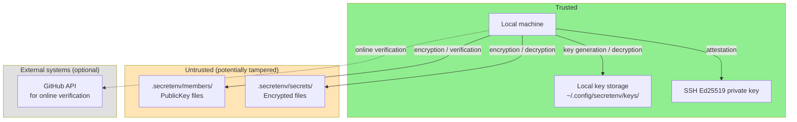
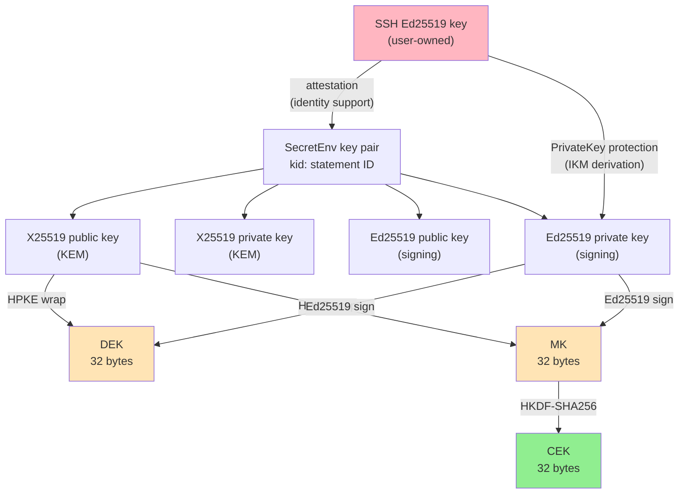
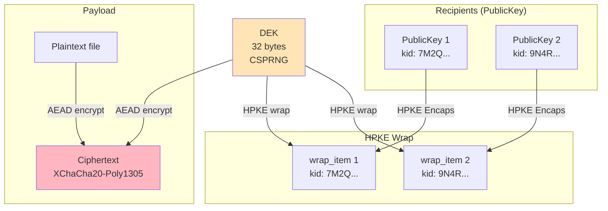
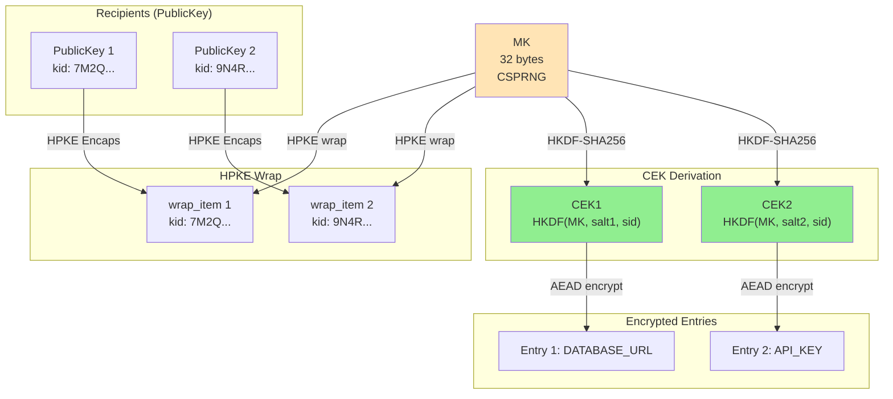
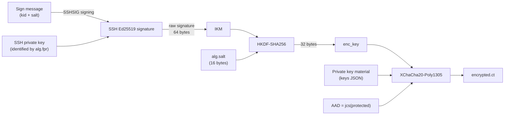
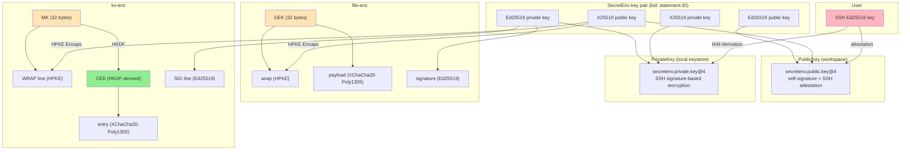

# SecretEnv v3 Security Design

---

## 0. Document Information

| Item | Value |
|------|-------|
| Version | 1.6 |
| Date | 2026-03-25 |

### Purpose of This Document

This document explains the security design of SecretEnv v3. Its primary purpose is to make it easy to determine what security claims SecretEnv makes, what assumptions those claims depend on, how those claims are ensured, and what is explicitly out of scope.

This document is not an implementation manual. It prioritizes design intent, verification points, and residual risk over step-by-step restatement of every algorithm and data structure detail.

---

## 1. Security Overview

SecretEnv is an offline-first encrypted file sharing CLI tool for safely sharing secrets such as `.env` files and certificates within a team. It can use a Git repository as a distribution medium, but does not depend on Git's existence.

### 1.1 Key Design Points

1. **security claims**: what is cryptographically protected and what is delegated to operational assumptions
2. **trust boundary**: local private keys and the local keystore are trusted; workspace public keys and encrypted files are not
3. **limits of key identity**: self-signature and attestation show key consistency and key binding, but identity ultimately depends on TOFU and operator judgment
4. **context binding**: `sid` / `kid` / `k` / `p` are used to prevent reuse and mix-ups
5. **critical implementation invariants**: signature-before-decrypt, preserving bindings, and respecting env-mode constraints

### 1.2 Security Claims and Verification

| security claim | Main mechanism | How this is ensured | Assumption | Residual risk |
|---------------|----------------|------------------------------|------------|---------------|
| **Confidentiality** | HPKE wrap + XChaCha20-Poly1305 | Only current recipients' public keys are used for wrapping | Recipient private keys are not compromised | Legitimate recipients can still exfiltrate plaintext |
| **Tamper detection** | Ed25519 signatures | Signature verification always happens before decryption | Verification is never bypassed | A malicious legitimate signer is not prevented |
| **Context binding** | `sid` / `kid` / `k` / `p` in info / AAD | Bindings are not omitted | The implementation preserves the intended binding points | Security weakens if a future change removes a binding |
| **Key consistency** | PublicKey self-signature | Tampering with an existing PublicKey is rejected | The original private key is not compromised | It does not prevent creation of a brand new malicious key |
| **Stronger key identity evidence** | SSH attestation + TOFU + online verify | The layers are not misrepresented as equivalent proofs | TOFU is executed correctly | Weakens with `--force`, misapproval, or account compromise |
| **Portable private key use** | Password export or SSH-based protection | CI use meets the stated trust conditions | Used only in a trusted CI context | Storing both secrets in the same backend is not independent defense |

### 1.3 Terminology Used Here

| Term | Meaning in this document |
|------|--------------------------|
| **Key consistency** | Evidence that the same private key holder created the PublicKey; not identity by itself |
| **Identity assurance** | Operational evidence that helps a human decide which person or account a key belongs to |
| **trust boundary** | The boundary between inputs trusted as-is and inputs assumed tamperable until validated |
| **residual risk** | Risk that remains even with a correct implementation, or when an operational assumption is not met |

---

## 2. Threat Model and Trust Boundary

### 2.1 Attacker Model

| Attacker | Capability | Assumed Scenario |
|----------|-----------|----------------|
| **Repository tamperer** | Can arbitrarily tamper with files under `.secretenv/` | Malicious CI, compromised Git server, unauthorized push |
| **Public key substituter** | Can replace `members/active/<id>.json` with a forged public key | MITM during new member addition, unauthorized commit to repository |
| **Key rotation attacker** | Retains old-generation wraps and attempts decryption with new keys | Exploiting weaknesses in the key update process |
| **Context confusion attacker** | Swaps ciphertext components between different secrets | Copy-and-paste across encrypted files |

### 2.2 Operational Assumptions

The attacker model above assumes repository write access is properly controlled. In the main target environment of Git + GitHub operation, changes to `members/active/` are checked through PR review. Attackers with unrestricted write access to the repository, such as compromise of repository administrator privileges, are outside the scope of this model.

If this assumption does not hold, repository-layer access control must be evaluated separately from SecretEnv's cryptographic design. It is important to distinguish between the security of the crypto design and the security of the distribution medium.

### 2.3 Trust Boundary



**Trusted elements:**
- Local machine and local key storage (`~/.config/secretenv/keys/`)
- User's SSH Ed25519 private key
- GitHub API (only during online verification, optional)

**Untrusted elements:**
- Workspace `members/` directory — verified by signatures and attestation
- Workspace `secrets/` directory — verified by signatures

### 2.4 Design Scope Summary

| Item | Implication |
|------|----------------------|
| **Guaranteed by design** | Confidentiality, tamper detection, context binding, key-generation binding, key consistency |
| **Depends on operational assumptions** | Identity decisions, safe CI execution conditions, repository-layer access control |
| **Not guaranteed** | Insider misuse prevention, recovery of prior disclosure, strong forward secrecy, centralized authorization policy |
| **Most important implementation checks** | Signature verification order, preserving bindings, env-mode restrictions, no skipped PublicKey verification |

### 2.5 Trust Model

"Key authenticity" in SecretEnv is not determined by a single mechanism. Instead, the system combines the following layers to provide more evidence for human trust decisions. No single layer alone establishes identity.

**Layer 1: Self-signature (key consistency)**

The self-signature included in a PublicKey shows that "the entity that created this PublicKey holds the corresponding private key." This supports **consistency** of the key, but does not establish **identity**. An attacker who creates a new SecretEnv key pair can generate a PublicKey with a valid self-signature.

The role of self-signature is limited to **tamper prevention** of existing PublicKeys. Modifying any field of a PublicKey in `members/active/` will cause self-signature verification to fail.

**Layer 2: SSH attestation (key binding)**

SSH attestation cryptographically ties a SecretEnv key pair to an SSH key. However, who owns the SSH key itself cannot be determined at this layer. An attacker can generate valid attestation by attesting their SecretEnv key with their own SSH key.

**Layer 3: TOFU confirmation (key → person binding)**

The user running `rewrap` visually confirms the SSH fingerprint and GitHub account information of the incoming member. This is the same trust model as confirming a first connection in SSH's `known_hosts`. **This is where the binding between key and person (as a basis for judgment) is first established for use in the workspace.**

When TOFU confirmation is skipped (with `--force`), promotion proceeds without interactive confirmation, so there is less evidence available for the identity decision. However, members who have been explicitly failed by online verification are excluded from promotion even when `--force` is used.

**Layer 4: Online verify (supplementary evidence)**

Automatically checks SSH public key registration via the GitHub API. This is useful supplementary evidence as long as the GitHub account is not compromised, but it does not establish identity on its own.

**Verification key for signature verification**

The verification key referenced during signature verification is determined by one of the following: the PublicKey identified from the workspace `members/active/` by `signature.kid`, or the PublicKey embedded in `signature.signer_pub` if present. When `signer_pub` is embedded, that PublicKey is confirmed via self-signature, expiration, `kid` match, and attestation (`attestation.method`) verification. In addition, PublicKey verification first re-derives `kid` from `protected_without_kid` and confirms that it matches `protected.kid`. This makes `kid` more than a lookup label: it is treated as an ID bound to the content of the self-signed key statement itself. The local keystore is used for private key storage but is not used as a public key source for signature verification. The workspace `active` is not a "trusted anchor" that provides trust to other users. Each user is responsible for judging the trustworthiness of a key (deciding which person's key to accept). Supporting information for this judgment is provided through SSH attestation and GitHub `binding_claims` (online verify).

**Risks of `--force` and recommended operation**: Since `--force` skips the interactive TOFU confirmation, it weakens the last line of defense against public key substitution attacks. However, in environments where online verification is available, promotion of members who fail verification is refused even with `--force`. In non-interactive environments such as CI/CD pipelines, `--force` may be necessary, in which case the following operations are recommended:
- In CI/CD environments, run `rewrap` in an interactive environment first to complete member promotion, then use `--force` in CI/CD
- After using `--force`, run `member verify` for online verification and post-hoc confirm the legitimacy of promoted members
- Manage the use of `--force` as a team operational policy and avoid unrestricted use

**Composite trust**

Stronger confidence in key authenticity depends on the above layers working as intended. However, the ways this confidence can break down differ by attack scenario:

- **Tampering with existing keys**: Requires SSH private key compromise. Since self-signature and SSH attestation cannot be forged, tampering cannot succeed without the original key holder's SSH private key.
- **Inserting a new key**: Can succeed with only TOFU misapproval (or omission via `--force`). An attacker can generate valid self-signature and attestation with their own key, so the victim's SSH key compromise is not required.

The conditions listed above are a composite of these multiple attack scenarios.

---

## 3. Selection of Cryptographic Primitives

### 3.1 Algorithm Summary

| Algorithm | Parameters | RFC | Purpose |
|-----------|-----------|-----|---------|
| HPKE Base mode | suite `hpke-32-1-3` | RFC 9180 | Content Key wrap/unwrap |
| DHKEM(X25519, HKDF-SHA256) | kem_id=32 (0x0020) | RFC 9180 | KEM (key encapsulation) |
| HKDF-SHA256 | kdf_id=1 (0x0001) | RFC 5869 | KDF (key derivation) |
| ChaCha20-Poly1305 | aead_id=3 (0x0003) | RFC 8439 | HPKE internal AEAD |
| XChaCha20-Poly1305 | nonce 24 bytes, key 32 bytes | — | payload / entry / PrivateKey encryption |
| Ed25519 (PureEdDSA) | — | RFC 8032 | Signing and verification |
| HKDF-SHA256 | — | RFC 5869 | CEK derivation, PrivateKey enc_key derivation |
| JCS | — | RFC 8785 | Deterministic JSON canonicalization |
| base64url (no padding) | — | RFC 4648 §5 | Binary encoding |

### 3.2 HPKE (RFC 9180)

**Rationale:**
- A standardized hybrid public key encryption scheme with a consistent definition of the KEM + KDF + AEAD combination
- Base mode provides ephemeral key isolation per wrap (however, if a recipient's long-term key is compromised, all existing wraps for that recipient can be decrypted; see §12.1)
- Clear suite ID identification via IANA Registry

**Suite configuration:**
```
hpke-32-1-3
├── kem_id  = 32 (0x0020) DHKEM(X25519, HKDF-SHA256)
├── kdf_id  = 1  (0x0001) HKDF-SHA256
└── aead_id = 3  (0x0003) ChaCha20-Poly1305
```

**Comparison with alternatives:**

| Alternative | Reason for rejection |
|-------------|---------------------|
| RSA-OAEP | Large key size; Forward Secrecy cannot be naturally achieved |
| ECIES (custom construction) | Not standardized; high risk of misconfiguration |
| Age (X25519-ChaChaPoly) | Less structured than HPKE for this use; insufficient flexibility for info/AAD |

**Known limitations:**
- Base mode does not provide sender authentication (supplemented by signatures)
- X25519 provides 128-bit security level

### 3.3 XChaCha20-Poly1305

**Rationale:**
- 24-byte nonce makes random nonce collision risk practically negligible (birthday bound at 2^96)
- Consistent performance even in environments without AES-NI
- Does not provide misuse resistance, but practical security is ensured by the large nonce space

**Comparison with alternatives:**

| Alternative | Reason for rejection |
|-------------|---------------------|
| AES-256-GCM | 12-byte nonce has high collision risk in multi-key usage |
| AES-256-GCM-SIV | Nonce misuse resistance is appealing, but rejected due to implementation complexity and limited adoption |

**Known limitations:**
- Nonce reuse is catastrophic (encrypting with the same key and nonce is prohibited)
- Compression before encryption is prohibited (to avoid compression oracle attacks CRIME/BREACH)

### 3.4 Ed25519 (RFC 8032 PureEdDSA)

**Rationale:**
- **Deterministic signatures**: Always generates the same signature for the same input. An essential property for use as IKM in PrivateKey protection.
- Fast signing and verification
- Affinity with SSH ecosystem (ssh-ed25519)

**Comparison with alternatives:**

| Alternative | Reason for rejection |
|-------------|---------------------|
| ECDSA (P-256) | Non-deterministic signatures (mitigable with RFC 6979, but handling varies across SSH implementations) |
| Ed448 | Insufficient adoption in the SSH ecosystem |

**Known limitations:**
- 128-bit security level
- Context separation is not provided by PureEdDSA itself (addressed by JCS canonicalization + protocol identifiers)

### 3.5 HKDF-SHA256 (RFC 5869)

**Rationale:**
- Standardized key derivation function
- The `info` parameter allows safely deriving purpose-specific keys from the same IKM
- The `salt` parameter allows deriving different keys even from the same IKM and info

**Uses:**
- CEK derivation for kv-enc (MK + salt + sid → CEK)
- enc_key derivation for PrivateKey protection (SSH signature + salt + kid → enc_key)

### 3.6 JCS (RFC 8785)

**Rationale:**
- Provides deterministic canonicalization of JSON objects
- Eliminates ambiguity in key ordering and number representation, ensuring consistency of signatures, AAD, and HPKE info
- No ambiguity arises even when string fields like `sid` contain arbitrary characters

### 3.7 Security Guarantees and Limits Inherited from Standard Cryptographic Primitives

| Primitive | Security property assumed in this section | Implication for SecretEnv |
|-----------|-------------------------------------------|----------------------------|
| HPKE Base mode (RFC 9180) | Provides confidentiality for recipient-specific key delivery, but does not provide sender authentication | Confidentiality of each recipient wrap depends on this, while producer authenticity and insider-attack resistance depend on Ed25519 signatures |
| XChaCha20-Poly1305 | Provides confidentiality and tamper detection as an AEAD, assuming nonces are not reused | Security of payload, entry, and PrivateKey protection depends on nonce uniqueness and does not tolerate nonce reuse |
| Ed25519 (PureEdDSA) | Provides unforgeability and tamper detection as long as the signing private key remains secret | Authenticity of encrypted files and PublicKey documents depends on this, and that guarantee collapses if the signing private key is compromised |
| HKDF-SHA256 | Can derive pseudorandom, purpose-separated keys from input key material with sufficient entropy | Key separation for CEKs and `enc_key` depends on this, but HKDF does not turn low-entropy input into high-entropy key material |

**Security dependency:**

- Overall confidentiality depends on both the confidentiality of HPKE for recipient-specific key delivery and the confidentiality of the AEAD that protects the payload itself. SecretEnv's overall confidentiality does not hold if either of these fails.
- Tamper detection depends on Ed25519 signatures. HPKE Base mode does not provide sender authentication by itself, so signatures provide the check that encrypted files and PublicKey documents were produced by the expected signer and have not been modified.
- Cryptographic independence between entries in kv-enc depends on the PRF security of HKDF-SHA256. In SecretEnv, a distinct CEK is derived for each entry from a high-entropy MK, so knowledge about one entry is not expected to directly reveal the CEK of another entry.

**Preconditions and limitations:**
- HPKE Base mode assumes confidentiality of the recipient's long-term private key. If the long-term key is compromised, all wraps for that recipient can be decrypted (see §12.1).
- XChaCha20-Poly1305 depends on nonce uniqueness in practice, and nonce reuse can lead to serious problems.
- Ed25519 assumes private key confidentiality. In SecretEnv, the signing private key is stored encrypted by PrivateKey protection (§7).

### 3.8 Nonce Safety Margin

XChaCha20-Poly1305 uses a 24-byte (192-bit) nonce. In SecretEnv's design, there are no cases where the same symmetric key is used for multiple encryptions. DEK (file-enc), CEK (kv-enc entry), and enc_key (PrivateKey protection) are each uniquely generated or derived per encryption, so the risk of nonce collision is structurally eliminated.

The choice of 192-bit nonce space serves as a safety net in case future design changes introduce same-key reuse.

---

## 4. Key Hierarchy and Key Lifecycle

### 4.1 Key Types and Relationships



This diagram intentionally separates the SSH key from the SecretEnv key pair.

- The **SSH key** is an external authentication key already owned by the user; it does not directly encrypt or sign SecretEnv workspace payloads
- The **SecretEnv key pair** is the application-specific key material used for encryption, decryption, signing, and verification inside the workspace
- The SSH key has only two roles
  - **attestation**: show which SSH key backs a SecretEnv public key
  - **PrivateKey protection**: derive the `enc_key` used to unlock the SecretEnv private key stored in the local keystore

Therefore, the SSH key is not the SecretEnv key pair itself. It is an outer key used to support provenance checks and local protection of the SecretEnv key pair.

### 4.2 Key Parameter Summary

| Key type | Size | Generation method | Purpose | Zeroization required |
|----------|------|------------------|---------|---------------------|
| SSH Ed25519 private key | 32 bytes | User-managed | attestation, PrivateKey protection | N/A (OS-managed) |
| X25519 private key (KEM) | 32 bytes | CSPRNG | HPKE unwrap | MUST |
| X25519 public key (KEM) | 32 bytes | Derived from X25519 private key | HPKE wrap | — |
| Ed25519 private key (signing) | 32 bytes | CSPRNG | Signature generation | MUST |
| Ed25519 public key (signing) | 32 bytes | Derived from Ed25519 private key | Signature verification | — |
| DEK (Data Encryption Key) | 32 bytes | CSPRNG | file-enc payload encryption | MUST |
| MK (Master Key) | 32 bytes | CSPRNG | CEK derivation source for kv-enc | MUST |
| CEK (Content Encryption Key) | 32 bytes | Derived via HKDF-SHA256 | kv-enc entry encryption | MUST |
| enc_key (for PrivateKey protection) | 32 bytes | Derived via HKDF-SHA256 | PrivateKey AEAD encryption | MUST |

Notes:

- `enc_key` is not a stored or pre-existing key; it is a transient symmetric key derived from SSH signing output each time
- The same SSH key can protect multiple SecretEnv key statements, but different `kid` / `salt` values produce different `enc_key` values
- The `private.json` stored in the local keystore contains only the ciphertext of SecretEnv private key material; the SSH private key itself remains outside SecretEnv storage

### 4.3 Key Lifecycle

Each SecretEnv key pair is associated with a `kid` (key statement ID). The canonical stored form is a 32-character Crockford Base32 string without hyphens, deterministically derived from the self-signed `PublicKey@4.protected` content excluding `kid`. It follows this lifecycle:

**Meaning of `kid`**: Since `kid` is derived from `protected_without_kid`, **`kid` equality implies key statement content equality**. If any field in `protected_without_kid` changes (including public keys, identity, binding claims, or expiration metadata), the derived `kid` necessarily changes.

```
generated → active → expired
              │
              └── rotate (generate new key pair with new key statement)
```

- **Generated**: Key pair is generated by the `key new` command. The resulting `PublicKey@4.protected` content deterministically defines `kid`.
- **Collision rejection at generation time**: Before saving, the derived `kid` is checked against the entire local keystore to confirm that no existing key already uses that `kid`. If the same `kid` is already present, generation is rejected as an inconsistent local state.
- **Active**: State usable for encryption and signing. `expires_at` has not been reached.
- **Expired**: State past `expires_at`. Encryption (wrap) operations are rejected. Signature verification is permitted with a warning (to allow verification of data legitimately signed in the past).

### 4.4 Key Rotation

Key rotation is performed by the `rewrap` command. The behavior differs between file-enc and kv-enc and between recipient changes and explicit `--rotate-key`. See §6.7 for the full comparison after both protocols have been introduced.

### 4.5 Key Relationship Diagrams

#### file-enc key relationships



#### kv-enc key relationships



---

## 5. file-enc Protocol

### 5.0 Data Structure Overview

file-enc is a JSON-format file with a two-layer structure consisting of signed data (`protected`) and the signature (`signature`).

**Structurally important security properties:**

1. **Signature coverage**: The `wrap` array and `payload` are stored within `protected`. Therefore, the Ed25519 signature over the entire `protected` protects the integrity of both wrap (key distribution) and payload (ciphertext).
2. **Dual presence of sid**: `sid` exists both directly under `protected` and within `payload.protected`. Verifying that both match at decryption time detects payload swapping.
3. **Payload envelope**: The payload itself has a protected header (`payload.protected`), whose JCS canonicalization becomes the AEAD AAD. This establishes the payload's cryptographic binding independently from the outer signature.

#### Overall file structure (JSON layout)

The overall structure of file-enc nests in order: top level (signed container) → `protected` (signed data) → `wrap` (DEK distribution) / `payload` (ciphertext).

```
{
  "protected": {
    "format": "secretenv.file@3",    // format identifier
    "sid": "<UUID>",                 // uniquely identifies the file (used to bind wrap/payload)
    "wrap": [
      {
        "rid": "<member_id>",        // recipient's member_id (informational only)
        "kid": "<canonical kid>",    // recipient key statement ID (keystore lookup key; included in HPKE info)
        "alg": "hpke-32-1-3",        // HPKE algorithm identifier
        "enc": "<b64url>",           // HPKE encapsulated key (enc in base mode)
        "ct": "<b64url>"             // HPKE ciphertext (ct wrapping DEK)
      }
      // ... one element per recipient ...
    ],
    "payload": {
      "protected": {
        "format": "secretenv.file.payload@3",
        "sid": "<UUID>",             // same as protected.sid (verified before decryption)
        "alg": { "aead": "xchacha20-poly1305" }
      },
      "encrypted": {
        "nonce": "<b64url>",         // 24 bytes
        "ct": "<b64url>"             // AEAD ciphertext (entire plaintext file)
      }
    },
    "created_at": "<RFC3339>",       // file creation timestamp
    "updated_at": "<RFC3339>"        // file update timestamp
  },
  "signature": {
    // signature_v3 (§8.2): signature over JCS-canonicalized protected, etc.
  }
}
```

This layout allows (1) the signature to detect tampering in the entire `protected` (= wrap and payload), while (2) the payload has its own header binding via `payload.protected` as AAD, independent from the outer signature.

### 5.1 Encryption Flow

```
1. DEK generation     — 32 bytes, CSPRNG
2. HPKE wrap          — wrap DEK with each recipient's public key
3. AEAD encryption    — encrypt plaintext file with DEK using XChaCha20-Poly1305
4. Ed25519 signature  — JCS-canonicalize the entire protected object and sign
```

### 5.2 DEK Generation

- 32 bytes of cryptographically secure random bytes (`OsRng`)
- Unique per file-enc file
- Zeroized after use

### 5.3 HPKE wrap

For each recipient:

```
info_bytes = jcs({
    "kid": <wrap_item.kid>,
    "p": "secretenv:file:hpke-wrap@3",
    "sid": <protected.sid>
})

aad_bytes = info_bytes   // defence-in-depth

(enc, ct) = HPKE.SealBase(pk_recip, info_bytes, aad_bytes, DEK)
```

**Design decision: why HPKE info and AAD are identical**

HPKE internally passes info to the KDF and AAD to the AEAD. By making them identical:
- The AAD layer defends against bypass attacks at the KDF stage
- The info layer defends against bypass attacks at the AEAD stage
- Defence-in-depth is achieved

### 5.4 Payload Encryption

```
payload.protected = {
    "format": "secretenv.file.payload@3",
    "sid": <protected.sid>,          // same value as outer sid
    "alg": { "aead": "xchacha20-poly1305" }
}

aad = jcs(payload.protected)
nonce = random(24 bytes)
ct = XChaCha20Poly1305.Encrypt(DEK, nonce, aad, plaintext)

// store nonce and ct in payload.encrypted
payload.encrypted = { "nonce": b64url(nonce), "ct": b64url(ct) }
```

### 5.5 Decryption Flow

```
1. Signature verification  — immediate error on failure (decryption does not proceed)
2. Key lookup              — locate private key in keystore by kid
3. wrap_item search        — find the matching wrap_item by kid (not rid)
4. HPKE unwrap             — reconstruct info/AAD and recover DEK
5. sid verification        — confirm payload.protected.sid == protected.sid
6. AEAD decryption         — decrypt payload with DEK
```

**Important: Signature verification precedes decryption.** Decrypting a ciphertext with an invalid signature exposes the cryptographic primitive to malicious input and increases the attack surface for side-channel attacks.

---

## 6. kv-enc Protocol

### 6.0 Data Structure Overview

kv-enc is a line-based text format consisting of the following line types:

```
:SECRETENV_KV 3          ← version identifier (included in signed data)
:HEAD <token>             ← file metadata (sid, timestamps)
:WRAP <token>             ← HPKE wrap array of MK + removed_recipients
<KEY> <token>             ← encrypted entry (contains salt, nonce, ct)
:SIG <token>              ← Ed25519 signature
```

Each token is a JCS-canonicalized JSON object encoded in base64url.

**Structurally important security properties:**

1. **Signature coverage**: All lines except `:SIG` (`:SECRETENV_KV 3`, `:HEAD`, `:WRAP`, all KEY lines) are signed. Including the version line defends against version downgrade attacks.
2. **Separation of wrap and entries**: Unlike file-enc, wrap (`:WRAP` line) and encrypted entries (KEY lines) exist as independent lines. This means wrap regeneration is not required for partial updates via `set`.
3. **Entry self-containment**: Each entry token contains its own `salt`, `k` (KEY), `aead`, `nonce`, and `ct`. The `sid` is obtained from `:HEAD` and used for CEK derivation and AAD construction.
4. **canonical_bytes construction**: The signed data is the byte sequence of all lines concatenated with LF (0x0A) terminators. CRLF is normalized to LF. The field separator is space (0x20).

### 6.1 Design Rationale for Two-Layer Key Structure

kv-enc adopts a two-layer key structure of MK → CEK:

```
MK (1 per file) ─── HPKE wrap ──→ each recipient
  │
  ├── HKDF(MK, salt1, sid) ──→ CEK1 ──→ entry1 encryption
  ├── HKDF(MK, salt2, sid) ──→ CEK2 ──→ entry2 encryption
  └── HKDF(MK, saltN, sid) ──→ CEKN ──→ entryN encryption
```

**Why two layers:**
- When updating a specific entry with `set`, other entries do not need to be re-encrypted
- Partial decryption of a specific entry with `get` is possible
- There is no need to re-execute HPKE wrap for all recipients each time

### 6.1.1 Encryption/Decryption Flow Overview

**Encryption flow:**

```
1. MK generation      — 32 bytes, CSPRNG
2. HPKE wrap          — wrap MK with each recipient's public key (info = AAD)
3. For each entry:
   a. salt generation — 16 bytes, CSPRNG
   b. CEK derivation  — HKDF-SHA256(MK, salt, sid)
   c. AEAD encryption — encrypt VALUE with CEK using XChaCha20-Poly1305
4. Ed25519 signature  — sign canonical_bytes of all lines (see §8.3)
```

**Decryption flow:**

```
1. SIG line verification — immediate error on failure (decryption does not proceed)
2. Key lookup            — locate private key in keystore by kid
3. HPKE unwrap           — reconstruct info/AAD and recover MK
4. For each entry:
   a. CEK derivation    — HKDF-SHA256(MK, salt, sid)
   b. AAD construction  — jcs({"k", "p", "sid"})
   c. AEAD decryption   — decrypt ciphertext with CEK
```

As with file-enc (§5.5), **signature verification precedes decryption**.

### 6.2 CEK Derivation

```
salt_bytes = base64url_decode(entry.salt)   // 16 bytes

CEK = HKDF-SHA256(
    ikm    = MK,                            // 32 bytes
    salt   = salt_bytes,                    // 16 bytes
    info   = jcs({
        "p":   "secretenv:kv:cek@3",
        "sid": <HEAD.sid>
    }),
    length = 32
)
```

Including `sid` in info means that even if an entry is copied between different files, a different CEK is derived, causing decryption to fail.

### 6.3 Entry AAD

```
aad = jcs({
    "k":   <entry.k>,                      // dotenv KEY
    "p":   "secretenv:kv:payload@3",
    "sid": <HEAD.sid>
})
```

**Design decisions:**
- Include `k` → prevents entry swapping within the same file
- Include `sid` → double-binding with CEK derivation info (defence-in-depth)
- Do not include `salt` → already used as HKDF salt argument
- Do not include `recipients` → to allow wrap replacement while keeping payload fixed during rewrap

### 6.4 HPKE wrap (kv)

```
info_bytes = jcs({
    "kid": <wrap_item.kid>,
    "p":   "secretenv:kv:hpke-wrap@3",
    "sid": <HEAD.sid>
})

aad_bytes = info_bytes   // defence-in-depth: same policy as file-enc
```

As with file-enc (§5.3), the same bytes are used for HPKE info and AAD. This ensures binding at both the KDF stage and the AEAD stage in kv-enc wraps as well, achieving defence-in-depth.

### 6.5 Partial Decryption (get / set)

The kv-enc design allows operating on specific entries without decrypting all entries:

- **get**: SIG verification → MK unwrap → CEK derivation for specified KEY → decrypt only that entry
- **set**: SIG verification → MK unwrap → new salt generation → CEK derivation → VALUE encryption → entry addition/replacement → SIG regeneration

### 6.6 Behavior on Recipient Removal

When a recipient is removed from kv-enc:

1. Generate new MK
2. Re-encrypt all entries with CEK derived from the new MK
3. Record the removed member in `removed_recipients`
4. Attach `disclosed: true` to all entries
5. Update the WRAP line

The `disclosed` flag makes visible the entries that may have been disclosed to the removed recipient, supporting the decision to update secrets.

### 6.7 Key Rotation Behavior Across Both Formats

`rewrap` updates wrap entries (recipient addition/removal). `rewrap --rotate-key` regenerates the content key and re-encrypts the entire payload.

| Operation | Format | Content Key | Wrap | Payload |
|-----------|--------|-------------|------|---------|
| Add recipients | file-enc | DEK maintained | Added | Maintained |
| Add recipients | kv-enc | MK maintained | Added | Maintained |
| Remove recipients | file-enc | DEK maintained | Removed | Maintained |
| Remove recipients | kv-enc | **MK regenerated** | Rebuilt | **Re-encrypted** |
| `--rotate-key` | file-enc | DEK regenerated | Rebuilt | Re-encrypted |
| `--rotate-key` | kv-enc | MK regenerated | Rebuilt | Re-encrypted |

For recipient addition, both formats maintain the content key and add new wrap entries.

For recipient removal, the behavior differs by format. In file-enc, the removed recipient's wrap entry is deleted and a removal history is recorded, but the DEK is unchanged; the removed recipient no longer possesses a wrap entry to recover the DEK. In kv-enc, the MK is always regenerated and all entries are re-encrypted. This is because the MK is a long-lived key from which per-entry CEKs are derived (§6.2) — if a removed member retains knowledge of the old MK (e.g., from a prior decryption session), they could derive CEKs for entries added after their removal. Regenerating the MK eliminates this risk.

`--rotate-key` forces full re-encryption in both formats regardless of recipient changes, and is intended as a post-compromise damage-limitation measure.

---

## 7. PrivateKey Protection

### 7.1 Passwordless Design via SSH Key Reuse

SecretEnv's PrivateKey (KEM private key + signing private key) is encrypted and protected using the user's existing SSH Ed25519 key. This eliminates the need for password management specific to SecretEnv.

What is protected here is the SecretEnv private key stored in the local keystore. The SSH key does not directly decrypt workspace secrets. Instead, it first unlocks the SecretEnv private key in the local keystore, and the recovered SecretEnv private key is then used for HPKE unwrap and Ed25519 signing.

### 7.1.1 Relationship Between the SSH Key and the SecretEnv Key Pair

- The SSH key is an **existing user-owned authentication key** outside SecretEnv
- The SecretEnv key pair is an **application-specific key pair** managed per `kid`
- On the PublicKey side, the SSH key appears in attestation, showing which SSH key is bound to the SecretEnv key pair
- On the PrivateKey side, the same SSH key protects the encrypted SecretEnv private key stored in the local keystore

Therefore, the SSH key and the SecretEnv key pair are not fused into a single key. One SSH key may protect multiple generations of SecretEnv keys, while the actual file-enc / kv-enc cryptographic operations are performed by the SecretEnv key pair after it has been decrypted.

### 7.1.2 What Is Stored in the local keystore

Each `kid` directory in the local keystore (a key-statement directory) contains two files.

- `public.json`: a PublicKey document that can be distributed to the workspace
- `private.json`: an encrypted SecretEnv private key document

In keystore mode, when `private.json` is used, the sibling `public.json` in the same directory is also loaded and verified as a PublicKey, and the implementation confirms `private.protected.member_id == public.protected.member_id` and `private.protected.kid == public.protected.kid`. This is a local keystore invariant intended to detect swapped public/private pairs or other broken local state early. In env mode using `SECRETENV_PRIVATE_KEY`, this sibling `public.json` check is intentionally not assumed.

`private.json` itself has two layers.

- `protected`: header fields such as `member_id`, `kid`, `alg.fpr`, `alg.salt`, `created_at`, and `expires_at`; these define the decryption conditions and tamper-detection scope
- `encrypted`: the ciphertext containing the actual SecretEnv private key material

Here `alg.fpr` is only an identifier for the SSH key used to protect that key generation. It is not the SSH private key itself.

### 7.2 Key Derivation Pipeline



### 7.3 Sign Message

```
secretenv:key-protection@4
{kid}
{hex(salt)}
```

Each line is separated by LF (`0x0A`). Since `member_id` is an arbitrary string, it is not used for cryptographic purposes; only canonical `kid` is used.

### 7.4 SSHSIG signed_data

SSH signatures conform to the SSHSIG format:

```
byte[6]      "SSHSIG"
SSH_STRING   namespace = "secretenv"
SSH_STRING   reserved = ""
SSH_STRING   hash_algorithm = "sha256"
SSH_STRING   SHA256(sign_message)
```

### 7.5 Encryption Key Derivation

```
enc_key = HKDF-SHA256(
    ikm    = ed25519_raw_signature_bytes,    // 64 bytes
    salt   = protected.alg.salt,             // 16 bytes
    info   = "secretenv:private-key-enc@4:{kid}",
    length = 32
)
```

This `enc_key` is not a stored fixed key. It is re-derived from the same SSH signing capability during both encryption and decryption.

### 7.6 Determinism Check

Ed25519 (RFC 8032 PureEdDSA) generates deterministic signatures by specification, but to eliminate the possibility of non-deterministic signatures due to implementation defects, on each encryption and decryption:

1. Execute **2 signatures** with the SSH key on the same signed_data
2. Confirm that the extracted Ed25519 raw signature bytes (64 bytes) match
3. If they do not match, output `W_SSH_NONDETERMINISTIC` and abort processing

**Reason:** Non-deterministic signatures would derive different IKM at encryption and decryption time, making **decryption impossible**.

### 7.6.1 Conditions for Successful Decryption

To decrypt `private.json` in the local keystore, all of the following conditions must hold.

1. The SSH key corresponding to `protected.alg.fpr` must be usable
2. That SSH key must produce deterministic signatures for identical input
3. The sign message must be reconstructible from `protected.alg.salt` and `kid`
4. `protected` must be untampered so that AAD verification over `jcs(protected)` succeeds

Conversely, an attacker does not necessarily need to steal the SSH private key file itself; any actor with equivalent signing capability can derive `enc_key`.

### 7.7 AAD

```
aad = jcs(protected)
```

Using the JCS-canonicalized bytes of the entire `protected` object as AAD means that `format`, `member_id`, `kid`, `alg`, `created_at`, and `expires_at` are all subject to tamper detection. Notably, including `expires_at` in AAD detects tampering with the expiration date.

### 7.7.1 How to Read the Decryption Flow

The high-level local keystore protection flow is:

1. Load `private.json`
2. In keystore mode, also load the sibling `public.json` from the same `kid` directory, verify it as a PublicKey, and confirm `member_id` / `kid` consistency
3. Read `kid`, `salt`, and the SSH key fingerprint from `protected`
4. Rebuild the sign message from `kid + salt`
5. Ask the SSH key to sign and extract raw Ed25519 signature bytes as IKM
6. Derive `enc_key` via HKDF
7. Decrypt the ciphertext using `jcs(protected)` as AAD

This means the SSH key is both an authentication mechanism for local keystore access and, in practice, the source of decryption capability.

### 7.8 Trust Assumptions

Since PrivateKey protection derives IKM from SSH signatures, **any entity that can execute `sign_for_ikm` can derive the encryption key and decrypt the PrivateKey**. This equivalence is an intentional design decision, but the following is stated to clarify trust boundaries.

| Entity | Can decrypt | Notes |
|--------|------------|-------|
| Local user (direct file access) | **Yes** | Normal use |
| ssh-agent (local) | **Yes** | Can issue signing requests if key is loaded |
| ssh-agent forwarding | **Yes** | Can issue signing requests from remote host. Weakens protection. |
| Local malware | **Yes** | If it can access key files or agent socket |
| CI/CD environment | **Yes** | If SSH key is deployed. Dedicated key recommended. |
| Hardware token (FIDO2) | **No** | Ed25519-SK uses non-deterministic signatures, so IKM derivation is impossible. Detected by §7.6 determinism check. |

**Note on ssh-agent forwarding**: In environments with agent forwarding enabled, processes on the remote host can send signing requests to the local ssh-agent. This allows administrators or malware on the remote host to decrypt the PrivateKey. Disabling agent forwarding is recommended in environments using SecretEnv.

**Clarifying design intent**: The equivalence between SSH signing capability and PrivateKey decryption capability is an intentional design decision. SecretEnv uses the existing SSH authentication infrastructure as a trust anchor for cryptographic key protection, eliminating the need for additional password or master key management. This tradeoff means that the SSH key's protection level becomes the upper bound of SecretEnv's secret protection level. Therefore, proper SSH key management (setting passphrases, restricting agent forwarding, considering hardware token use) is essential to SecretEnv's security.

Operationally, local keystore file permissions and SSH key handling must not be treated as separate concerns. Even if `private.json` has safe filesystem permissions, any actor on the same host that can freely use the SSH key or agent socket can ultimately decrypt the SecretEnv private key as well.

### 7.9 Password-Based Key Protection (`argon2id-hkdf-sha256`)

As an alternative to SSH-based protection, SecretEnv supports password-based private key protection using `argon2id-hkdf-sha256`. This scheme is designed for CI/CD environments where SSH keys and `ssh-agent` are unavailable.

#### 7.9.1 Use Case

CI platforms provide "secret variables" that are stored securely and exposed as environment variables at runtime. This protection scheme enables exporting a SecretEnv private key in a portable, password-protected format that can be registered as a CI secret variable and used without any SSH infrastructure.

#### 7.9.2 Key Derivation Pipeline

```
Password + salt (16 bytes, random) → Argon2id (m=47104, t=1, p=1) → 32-byte IKM
IKM + salt → HKDF-SHA256 (info: "secretenv:password-private-key-enc@4:{kid}") → 32-byte encryption key
```

The salt is intentionally reused for both Argon2id and HKDF steps. This is safe because the two algorithms have different internal structures and the salt serves different roles in each (Argon2id uses it as a salt parameter, HKDF uses it as the salt input to HKDF-Extract).

The HKDF info string (`secretenv:password-private-key-enc@4:{kid}`) differs from the SSH-based scheme (`secretenv:private-key-enc@4:{kid}`) to ensure domain separation between the two key derivation paths.

#### 7.9.3 Argon2id Parameters and Password Requirements

- Default parameters at export time: m=47104 (46 MiB), t=1, p=1 (OWASP recommended)
- Parameters are fixed by the implementation and are not serialized in the private key document
- Minimum password length: 8 characters

#### 7.9.4 Security Trade-offs in CI Environments

Environment variables (`SECRETENV_KEY_PASSWORD`) persist in process memory and may be visible via `/proc/*/environ` on Linux. This is an accepted trade-off consistent with how CI platforms handle secret variables. What is accepted here is runtime exposure caused by environment-variable delivery, not the idea that storing `SECRETENV_KEY_PASSWORD` in the same secret backend as `SECRETENV_PRIVATE_KEY` creates an independent barrier against backend compromise. The password and decrypted key material are zeroized after use where the Rust type system permits (using the `zeroize` crate).

The main security value of this password protection is defense when the exported blob leaks by itself. For example, if only the `SECRETENV_PRIVATE_KEY`-equivalent blob escapes through an exported file, copied text, artifact, or clipboard content, the key still cannot be decrypted immediately unless the password is also disclosed.

By contrast, when `SECRETENV_PRIVATE_KEY` and `SECRETENV_KEY_PASSWORD` are stored in the same CI secret backend, the password provides little independent protection against compromise of that backend itself, because both values are typically obtained together. This configuration is therefore useful for portable SSH-free operation, but it must not be interpreted as "placing both in one secret backend still gives meaningful defense-in-depth against backend compromise."

If operations can place `SECRETENV_PRIVATE_KEY` and `SECRETENV_KEY_PASSWORD` in separate trust domains, the password protection becomes more meaningful. In the common case where both are stored in the same CI secret backend, the practical protection is primarily limited to blob-only leakage scenarios.

#### 7.9.5 Public Key Verification in Environment Variable Mode

Environment variable mode permits only `run`, `decrypt`, `get`, and `list`. At key-load time, the implementation only decrypts the exported PrivateKey from `SECRETENV_PRIVATE_KEY` with `SECRETENV_KEY_PASSWORD` and validates the PrivateKey document itself. `list` is metadata-only and does not require key loading.

The key-load path performs the following checks:

1. Base64url-decode `SECRETENV_PRIVATE_KEY`
2. Decrypt it with `SECRETENV_KEY_PASSWORD`
3. Validate the PrivateKey document structure and protection method
4. Validate keypair consistency for `sig.d` / `sig.x` and `kem.d` / `kem.x`

The implementation must not resolve the caller's own PublicKey from `members/active/` during env-key loading. Therefore the absence of `members/active/<member_id>.json`, or mismatches in that file, are not load-time failures for env mode.

However, `run`, `decrypt`, and `get` still use the normal signature-verification and member-resolution rules, which may read from the workspace checkout. The checkout remains outside the trust boundary in env mode as well. Therefore env mode may be used only in a trusted CI context that satisfies all of the following:

- **trusted workflow**: the workflow / job definition that consumes secrets is maintainer-controlled and cannot be modified or triggered from attacker-controlled PR content
- **trusted ref**: the checkout consumed by secretenv is a protected branch, protected tag, post-merge ref, or equivalent trusted ref
- **trusted runner**: the runner handling secrets is trusted and is not shared with untrusted workloads

Env mode must not be used in:

- fork PRs
- untrusted PRs
- `pull_request_target`
- jobs that perform an attacker-controlled checkout
- jobs running on untrusted runners

Typical allowed cases are post-merge workflows on protected branches and deploy jobs on protected tags. PR validation workflows that expose secrets are out of scope.

---

## 8. Signature and Verification Architecture

### 8.0 signature_v3 Common Format

Both file-enc and kv-enc use a common signature structure called `signature_v3`. This structure has the following security properties:

- **Self-contained verification**: The signer's PublicKey (`signer_pub`) can optionally be embedded within the signature. This allows signature verification and signer identification to complete without referencing an external keystore.
- **Explicit key statement reference**: Containing `kid` makes it clear which signed key statement was used for signing.
- **Ed25519 raw signature**: The signature value is base64url-encoded Ed25519 raw signature bytes (64 bytes) — a fixed length of 86 characters.

When the signature token contains `signer_pub`, it can also chain-verify the PublicKey's self-signature and SSH attestation, forming an offline trust chain.

### 8.1 Comparison of Signing Methods

| Item | file-enc | kv-enc |
|------|----------|--------|
| Signed data | `jcs(protected)` | canonical_bytes (concatenation of text lines) |
| Format | `signature` field in JSON | `:SIG` line (last line) |
| Tamper detection scope | Entire `protected` (sid, wrap, payload, timestamps) | HEAD / WRAP / all entry lines |
| Signature algorithm | `eddsa-ed25519` (PureEdDSA) | `eddsa-ed25519` (PureEdDSA) |
| Signature format | `signature_v3` format | `signature_v3` format |

### 8.2 file-enc Signature

```
canonical_bytes = jcs(protected)
signature = ed25519_sign(sig_priv, canonical_bytes)
```

- The `protected` object is JCS-canonicalized and signed directly (RFC 8032 PureEdDSA)
- `wrap`, `payload`, and `removed_recipients` are all contained within `protected` and therefore protected by the signature
- The `signature` field is not included in the signed data

### 8.3 kv-enc Signature

canonical_bytes construction procedure:

1. Normalize line endings in the input file to LF (0x0A) (CRLF → LF)
2. Concatenate in order all lines including the first line `:SECRETENV_KV 3` except the `:SIG` line
3. Append **line terminator** LF (0x0A) to the end of each line
4. The **field separator** within each line is space (0x20) (not tab)

Concrete byte-level example:
```
:SECRETENV_KV 3\n      ← line terminator: LF (0x0A)
:HEAD <token>\n         ← field separator: space (0x20), line terminator: LF
:WRAP <token>\n         ← field separator: space (0x20), line terminator: LF
DATABASE_URL <token>\n  ← field separator: space (0x20), line terminator: LF
```

**Distinction**: The LF in step 3 is a **line terminator**, while the space in step 4 is a **field separator** between the line header and the token. These serve different roles.

```
canonical_bytes = concat_lines_with_lf(all_lines_except_SIG)
signature = ed25519_sign(sig_priv, canonical_bytes)
```

### 8.4 PublicKey Self-Signature

A PublicKey has a self-signature over its `protected` object:

```
canonical_bytes = jcs(protected)
signature = ed25519_sign(identity.keys.sig private key, canonical_bytes)
```

This shows that "the holder of the corresponding private key created this PublicKey."

### 8.5 SSH Attestation

SSH key attestation over the `identity.keys` of a PublicKey:

1. JCS-canonicalize `identity.keys`
2. Compute SHA256 of the canonicalized bytes
3. Sign with the SSH key (namespace: `secretenv`)
4. Extract Ed25519 raw signature bytes (64 bytes) and store

This allows offline verification of the binding between the SecretEnv key pair and the SSH key.

### 8.6 Online Verification (GitHub)

When `binding_claims.github_account` exists, the fingerprint of `attestation.pub` is cross-checked against the public keys obtained from the GitHub API. This confirms that the SSH key is registered to the claimed GitHub account.

---

## 9. Context Binding and Defence-in-Depth

This chapter describes the binding design that prevents implementation drift. SecretEnv intentionally places `sid` / `kid` / `k` / `p` in multiple locations so that the system cryptographically fixes what a ciphertext belongs to and which key generation it was created for.

### 9.1 System of Binding Elements

| Binding element | Description | Attack it defends against |
|----------------|-------------|--------------------------|
| `sid` | File identifier (UUID) | Swapping ciphertext components between different files |
| `kid` | Key statement ID (canonical 32-char Crockford Base32) | Reusing wraps across different key statements |
| `k` | dotenv KEY | Swapping entries within the same kv-enc file |
| `p` | Protocol identifier | Reusing data across different protocols |

### 9.2 Rationale for Double-Binding

Why `sid` is included in both info and AAD:

**For kv-enc:**
- Including `sid` in CEK derivation info → `sid` affects CEK at the HKDF stage
- Also including `sid` in payload AAD → `sid` is also verified at the AEAD stage

While info alone is cryptographically sufficient, also including it in AAD provides:
1. **Implementation bug resilience**: If CEK is derived with the wrong `sid`, AEAD verification will fail
2. **Safety net for future changes**: Detection layer for changes to CEK derivation logic
3. **Miswiring detection**: Early detection when the wrong file's `sid` is mistakenly applied

### 9.3 HPKE info = AAD Design

In file-enc wrap, the same bytes are used for HPKE info and AAD:

```
info_bytes = jcs({"kid": ..., "p": "secretenv:file:hpke-wrap@3", "sid": ...})
aad_bytes  = info_bytes
```

This applies the same binding at both the KDF stage and the AEAD stage, so a bypass of one stage is detected by the other.

### 9.4 Design Decision to Exclude recipients from Payload AAD

Recipients (the list of rids in the wrap array) are **not** included in payload AAD.

**Reason:** To allow replacing only wraps while keeping payload fixed during `rewrap`. If recipients were included in AAD, the entire payload would need to be re-encrypted every time a recipient changes.

Recipient integrity is protected by **Ed25519 signatures** (wraps are contained within `protected`, which is the signed data).

### 9.5 Binding Matrix

| Binding element | Protocol | HPKE info | HPKE AAD | CEK info | payload AAD | Signature | Attack defended against |
|----------------|----------|-----------|----------|----------|-------------|-----------|------------------------|
| `sid` | file-enc wrap | **included** | **= info** | — | — | **included** | Reusing wraps across different files |
| `sid` | file-enc payload | — | — | — | **included** | **included** | Swapping payload between different files |
| `sid` | kv-enc wrap | **included** | **= info** | — | — | **included** | Reusing wraps across different files |
| `sid` | kv-enc CEK derivation | — | — | **included** | — | — | Copying entries between different files |
| `sid` | kv-enc payload | — | — | — | **included** | **included** | Defence-in-depth (duplication with CEK info) |
| `kid` | file-enc wrap | **included** | **= info** | — | — | **included** | Reusing old-generation wraps |
| `kid` | kv-enc wrap | **included** | **= info** | — | — | **included** | Reusing old-generation wraps |
| `k` | kv-enc payload | — | — | — | **included** | **included** | Swapping entries within the same file |
| `p` | all protocols | **included** | **included** | **included** | **included** | — | Reusing data across different protocols |

**Implementation note** — Each binding point in the table must remain present, must not be replaced with another input, and must be compared as canonicalized bytes rather than as ad hoc string values.

---

## 10. Major Attack Scenarios

### 10.1 Repository Tampering

| Item | Content |
|------|---------|
| **Attack** | Attacker tampers with encrypted files in `.secretenv/secrets/` |
| **Capability** | Write access to the repository |
| **Primary defense** | Ed25519 signature verification detects tampering with `protected` (file-enc) or the entire file (kv-enc) |
| **When it weakens** | An implementation decrypts before signature verification |
| **Expected failure point** | Decryption refused with `E_SIGNATURE_INVALID` |

### 10.2 Public Key Substitution

**10.2.1 Tampering with an existing PublicKey**

| Item | Content |
|------|---------|
| **Attack** | Attacker tampers with fields in `members/active/<id>.json` |
| **Capability** | Write access to the repository |
| **Primary defense** | (1) Self-signature verification (2) SSH attestation verification |
| **When it weakens** | The original SSH private key is compromised |
| **Expected failure point** | Refused with `E_SELF_SIG_INVALID` or `E_ATTESTATION_INVALID` |

**10.2.2 Attacker inserting a new key**

| Item | Content |
|------|---------|
| **Attack** | Attacker creates their own SecretEnv key + SSH key and places it in `members/incoming/` |
| **Capability** | Write access to the repository + their own SSH Ed25519 key |
| **Self-signature / attestation** | The attacker can generate valid self-signature and attestation with their own keys |
| **Primary defense** | (1) TOFU confirmation (2) supplementary evidence from online verify |
| **When it weakens** | TOFU misapproval, skipping TOFU via `--force`, or GitHub account compromise |
| **Expected failure point** | Human rejection or promotion refusal after verification failure |

**Important**: Self-signature prevents tampering with existing PublicKeys, but cannot prevent an attacker from creating a new PublicKey following legitimate procedures with their own key. The final defense against new key insertion is TOFU confirmation (§2.5, Layer 3). Skipping TOFU with `--force` intentionally disables this defense, and its use requires careful consideration.

### 10.3 Payload Swapping (Between Different Secrets)

| Item | Content |
|------|---------|
| **Attack** | Attacker copies the payload of file-enc A into file-enc B |
| **Capability** | Write access to the repository |
| **Primary defense** | (1) `sid` in payload AAD (2) signature verification |
| **When it weakens** | A future implementation change removes `sid` binding |
| **Expected failure point** | AEAD decryption failure or signature verification failure |

### 10.4 Entry Swapping (Within the Same kv-enc)

| Item | Content |
|------|---------|
| **Attack** | Attacker copies the ciphertext of entry A in a kv-enc to entry B in the same file |
| **Capability** | Write access to the repository |
| **Primary defense** | (1) `k` in AAD (2) signature verification |
| **When it weakens** | A future implementation change removes `k` binding |
| **Expected failure point** | AEAD decryption failure or signature verification failure |

### 10.5 Reusing Old Wraps

| Item | Content |
|------|---------|
| **Attack** | Attacker copies an old-generation wrap_item into a new encrypted file |
| **Capability** | Access to old encrypted files |
| **Primary defense** | `kid` in HPKE info |
| **When it weakens** | A future implementation change removes `kid` binding |
| **Expected failure point** | HPKE unwrap failure |

### 10.6 PrivateKey Metadata Tampering

| Item | Content |
|------|---------|
| **Attack** | Attacker tampers with a field in PrivateKey's `protected` (e.g., `expires_at`) |
| **Capability** | Access to the local filesystem |
| **Primary defense** | AAD = `jcs(protected)` |
| **When it weakens** | AAD generation no longer covers the full `protected` object |
| **Expected failure point** | XChaCha20-Poly1305 decryption failure |

### 10.7 Entry Copying Between kv-enc Files

| Item | Content |
|------|---------|
| **Attack** | Attacker copies an entry from kv-enc file A into kv-enc file B |
| **Capability** | Write access to the repository |
| **Primary defense** | (1) MK separation (2) `sid` in CEK derivation info (3) `sid` in payload AAD |
| **When it weakens** | `sid` is removed from CEK info or AAD |
| **Expected failure point** | AEAD decryption failure due to CEK mismatch |

These scenarios share a common structure: context bindings (`sid`, `kid`, `k`, `p`) and Ed25519 signatures form two independent layers of defense. Bypassing both simultaneously requires either compromise of the signer's private key or an implementation defect that removes a binding or reorders processing steps. The verification points in §11 are designed to detect such defects.

---

## 11. Implementation Verification Points

### 11.1 Highest-Priority Verification Points

| Review target | Expected implementation behavior | Risk if violated |
|---------------|----------------------------------|------------------|
| **Processing order** | Structural validation → signature verification → reference consistency checks → decryption | Tampered data may be decrypted first |
| **Bindings** | `sid` / `kid` / `k` / `p` are included in info / AAD as designed | Reuse, substitution, or wrong-context errors become possible |
| **HPKE info = AAD** | The wrap path uses the same bytes in both places | Defence-in-depth is lost |
| **PublicKey verification** | Self-signature and attestation are both verified | A tampered PublicKey may be accepted |
| **Signature key source** | The keystore is not used as a public-key source for signature verification | Verification may accidentally depend on local state |
| **env mode** | Only used in trusted CI contexts, without self PublicKey workspace lookup during key loading | Private keys may be used in attacker-controlled checkouts |

### 11.2 Input Validation and DoS Resistance

The implementation enforces conservative limits and strict parsing as shown below.

| Item | Expected limit / requirement | Purpose |
|------|------------------------------|---------|
| wrap array length | 1,000 entries | Prevent memory exhaustion |
| kv-enc file size | 16 MiB | Prevent memory exhaustion |
| kv-enc KEY line count | 10,000 lines | Prevent computational blow-up |
| base64url token length | 1 MiB | Limit parse time |
| JSON depth / element count | 32 levels / 10,000 elements | Prevent computational blow-up |

For base64url inputs, the implementation should reject invalid characters, padding (`=`), and whitespace or newlines, and should validate fixed-length fields.

### 11.3 Memory Handling of Secrets

KEM private keys, signing private keys, DEK / MK / CEK values, and decrypted plaintext should be zeroized after use as far as the type system allows. The design ensures that secret material is not retained in long-lived buffers or exposed through logs.

However, complete erasure of secret material from process memory is not guaranteed. When key bytes are copied into cryptographic library types (e.g., `SigningKey::from_bytes`), the `Zeroize` wrapper clears the source buffer but cannot control copies held internally by the library. Additionally, the runtime allocator may leave residual data in freed pages, and compiler optimizations may create intermediate copies that are not zeroized. SecretEnv therefore treats memory zeroization as a best-effort defense-in-depth measure, not an absolute guarantee.

---

## 12. Limitations and Non-Goals

### 12.1 Scope of Forward Secrecy

HPKE Base mode provides ephemeral key isolation per wrap via ephemeral keys. However:
- If a recipient's long-term private key is compromised, **all existing wraps** for that recipient can be unwrapped
- Running `rewrap --rotate-key` to regenerate the Content Key after compromise can prevent damage from spreading to newly encrypted data going forward

**Design rationale:** SecretEnv does not claim strong system-wide forward secrecy. `--rotate-key` is a post-compromise damage-limitation measure, not a mechanism that restores protection for data encrypted before the compromise.

### 12.2 Irrecoverability of Past Disclosures

Even if a recipient is removed, content that was previously decryptable is cryptographically irrecoverable. `removed_recipients` and the `disclosed` flag are operational aids for deciding whether secrets must be reissued; they are not a recovery mechanism.

### 12.3 Insider Misuse

It is not possible to prevent a workspace member who has legitimately decrypted content from misusing it. SecretEnv provides confidential distribution and tamper detection, but control over post-decryption use must come from another control layer.

### 12.4 Policy-Less Design

SecretEnv does not provide a centralized policy defining "who should hold which secret." The cryptographic design should be evaluated separately from the organization's approval and distribution process.

### 12.5 No Compression

Compression before encryption is not performed. This is an intentional design decision to avoid compression oracle attacks (in the class of CRIME/BREACH).

---

## 13. References and RFC List

| Specification | Purpose |
|--------------|---------|
| RFC 9180 — Hybrid Public Key Encryption | HPKE (wrap/unwrap) |
| RFC 8439 — ChaCha20 and Poly1305 | HPKE internal AEAD |
| draft-irtf-cfrg-xchacha — XChaCha20 and AEAD_XChaCha20_Poly1305 | XChaCha20-Poly1305 construction (payload / entry / PrivateKey encryption) |
| RFC 8032 — Edwards-Curve Digital Signature Algorithm (EdDSA) | Ed25519 signature (PureEdDSA) |
| RFC 8037 — CFRG Elliptic Curve Diffie-Hellman (ECDH) and Signatures in JOSE | JWK OKP key representation |
| RFC 7517 — JSON Web Key (JWK) | Key representation format |
| RFC 5869 — HMAC-based Extract-and-Expand Key Derivation Function (HKDF) | Key derivation |
| RFC 9106 — Argon2 Memory-Hard Function for Password Hashing and Proof-of-Work Applications | Password-based key protection (Argon2id) |
| RFC 8785 — JSON Canonicalization Scheme (JCS) | Deterministic JSON canonicalization |
| RFC 4648 — The Base16, Base32, and Base64 Data Encodings | base64url encoding |
| RFC 2119 — Key words for use in RFCs to Indicate Requirement Levels | Requirement level keywords |
| OpenSSH PROTOCOL.sshsig | SSHSIG signature format |
| IANA HPKE Registry | HPKE suite ID |

---

## Appendix

### Appendix A: High-Level Key Relationship Diagram



This diagram provides a quick overview of which secret protects which object and where signatures or wraps are applied. For concrete binding points and verification order, prefer the main text in §9 and §11.
