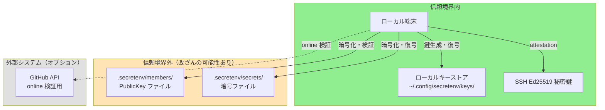
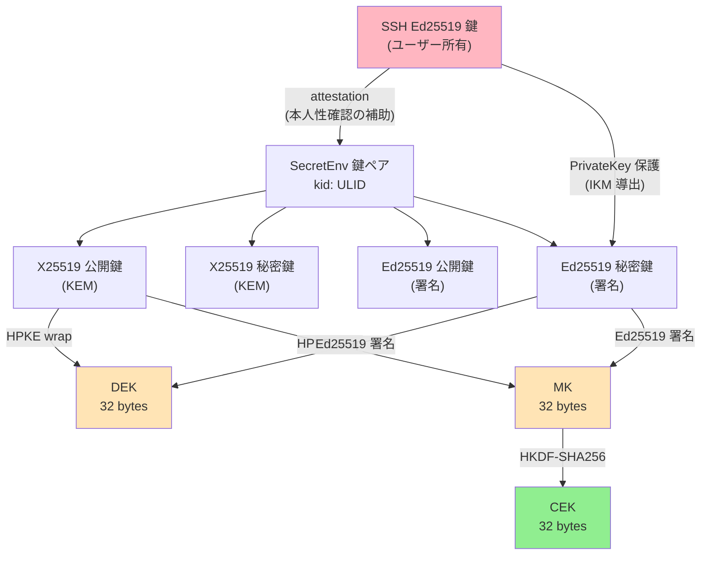
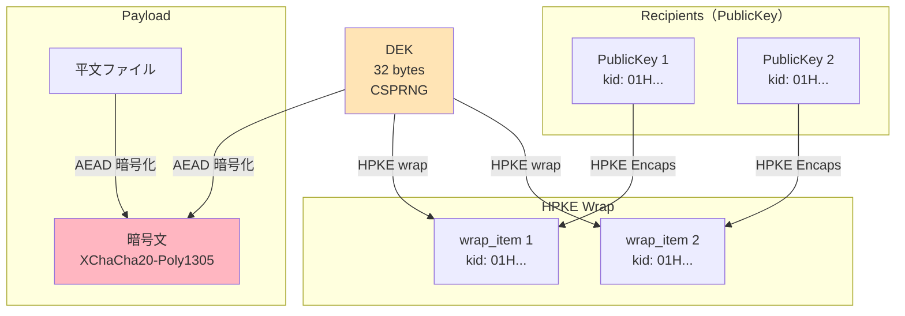
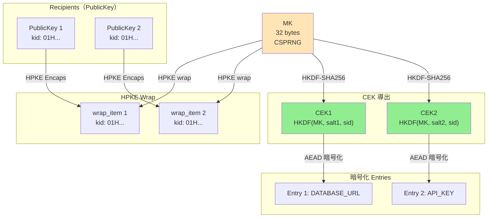
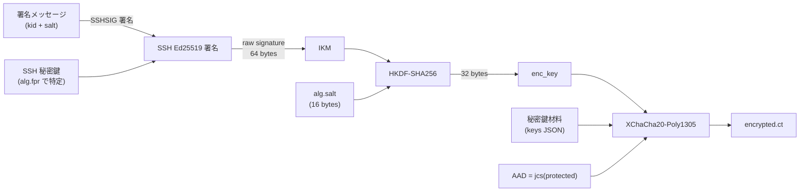
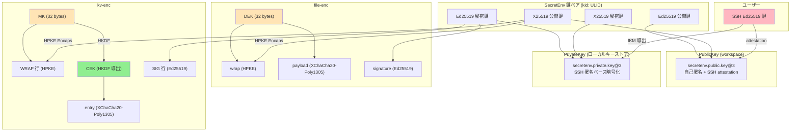

# SecretEnv v3 セキュリティ設計

---

## 0. 文書情報

| 項目 | 値 |
|------|-----|
| バージョン | 1.5 |
| 日付 | 2026-03-25 |

### 本書の位置づけ

本書は SecretEnv v3 のセキュリティ設計を、**セキュリティ監査者向け**に説明する文書である。主な目的は、SecretEnv が何を security claim として提示しているか、その成立条件が何か、監査時にどこを確認すべきか、何が非目標かを短時間で判断できるようにすることである。

本書は実装手順書ではない。アルゴリズムやデータ構造の全詳細を逐次的に説明することよりも、監査判断に必要な設計意図、検証点、残余リスクの整理を優先する。

---

## 1. 監査者向け要約

SecretEnv は、チーム内で `.env` ファイルや証明書などの秘密情報を安全に共有するためのオフライン優先（offline-first）の暗号ファイル共有 CLI ツールである。Git リポジトリを配布媒体として利用可能だが、Git の存在に依存しない。

### 1.1 最初に確認すべき論点

1. **security claims**: 何を暗号学的に防御し、何を運用前提に委ねているか
2. **trust boundary**: ローカル秘密鍵とローカルキーストアは信頼し、workspace 上の公開鍵・暗号ファイルは信頼しない
3. **鍵の本人性の限界**: 自己署名と attestation は鍵一貫性や鍵紐付けを示すが、本人性そのものは TOFU と運用判断に依存する
4. **文脈束縛**: `sid` / `kid` / `k` / `p` を使って流用や取り違えを防いでいる
5. **実装監査**: 署名検証前に復号しないこと、binding を削っていないこと、env mode の制約を守ることが重要である

### 1.2 security claim と監査観点

| security claim | 主な仕組み | 監査時の確認点 | 成立前提 | 残余リスク |
|---------------|-----------|---------------|---------|-----------|
| **機密性** | HPKE wrap + XChaCha20-Poly1305 | 現行 recipient の公開鍵だけで wrap されているか | recipient の秘密鍵が漏洩していない | 正当 recipient による持ち出しは防げない |
| **改ざん検知** | Ed25519 署名 | 復号前に署名検証するか | 署名検証が必ず実行される | 署名者自身が悪意を持つ場合は防げない |
| **文脈束縛** | `sid` / `kid` / `k` / `p` を info / AAD に含める | binding を省略していないか | 実装が仕様どおりの binding を維持する | binding を削る実装変更で弱くなる |
| **鍵一貫性** | PublicKey 自己署名 | 既存 PublicKey 改ざんで検証失敗するか | 元の秘密鍵が漏洩していない | 新規の悪意ある鍵作成は防げない |
| **鍵の本人性補強** | SSH attestation + TOFU + online verify | 各層の意味を混同していないか | TOFU が正しく行われる | `--force` や誤承認で弱くなる |
| **Portable な秘密鍵利用** | password export または SSH ベース保護 | CI 利用時の trust condition を満たすか | trusted CI context でのみ使う | 同一 secret backend への保存は独立防御にならない |

### 1.3 用語の使い分け

| 用語 | 本書での意味 |
|------|-------------|
| **鍵一貫性** | 同じ秘密鍵保持者がその PublicKey を作成したことを示す性質。本人性そのものではない |
| **本人性補強** | 鍵がどの人物・アカウントに紐付くかの判断材料を増やす運用層 |
| **trust boundary** | そのまま信用する領域と、改ざんを前提に検証して扱う領域の境界 |
| **残余リスク** | 仕様どおり実装しても残るリスク、または運用前提を満たさない場合に残るリスク |

---

## 2. 脅威モデルと trust boundary

### 2.1 攻撃者モデル

| 攻撃者 | 能力 | 想定シナリオ |
|--------|------|-------------|
| **リポジトリ改ざん者** | `.secretenv/` 配下のファイルを任意に改ざん可能 | 悪意ある CI、侵害された Git サーバ、不正な push |
| **公開鍵すり替え者** | `members/active/<id>.json` を偽造した公開鍵に置き換え可能 | 新メンバー追加時の MITM、リポジトリへの不正コミット |
| **鍵ローテーション攻撃者** | 古い鍵世代の wrap を保持し、新しい鍵での復号を試行 | 鍵更新プロセスの不備を突く |
| **コンテキスト混同攻撃者** | 異なる secret の暗号文コンポーネントを入れ替え | 暗号ファイル間でのコピー & ペースト |

### 2.2 運用前提

上記の脅威モデルは、リポジトリへの書き込みアクセスが適切に管理されていることを前提とする。主なターゲット環境である Git + GitHub 運用では、`members/active/` への変更は PR レビューを通じて検証される。リポジトリへの無制限な書き込みアクセスを持つ攻撃者（例: リポジトリ管理者権限の侵害）は、本モデルの対象外である。

この前提が満たされない環境では、incoming → active の昇格プロセスに加え、リポジトリ層でのアクセス制御を別途実施する必要がある。監査時には、SecretEnv 自体の暗号設計と、配布媒体のアクセス制御を分けて評価する必要がある。

### 2.3 信頼境界



**信頼する要素:**
- ローカル端末とローカルキーストア（`~/.config/secretenv/keys/`）
- ユーザーの SSH Ed25519 秘密鍵
- GitHub API（online 検証時のみ、オプション）

**信頼しない要素:**
- Workspace の `members/` ディレクトリ — 署名と attestation で検証
- Workspace の `secrets/` ディレクトリ — 署名で検証

### 2.4 監査上の主要判断

| 項目 | 監査上の見方 |
|------|---------------|
| **保証するもの** | 機密性、改ざん検知、文脈束縛、鍵世代束縛、鍵一貫性 |
| **運用前提に依存するもの** | 鍵の本人性判断、CI 上の安全な実行条件、リポジトリ層のアクセス制御 |
| **保証しないもの** | 内部者の悪用防止、過去開示の回収、強い意味での forward secrecy、中央ポリシーによる権限制御 |
| **実装で最重要な観点** | 署名検証順序、binding の保持、env mode 制約、PublicKey 検証の省略禁止 |

### 2.5 信頼モデル

SecretEnv における「鍵の本人性」は、単一の機構ではなく以下の層を組み合わせて判断材料を増やす考え方である。各層が単独で本人性を確定するものではない。

**層1: 自己署名（鍵一貫性）**

PublicKey に含まれる自己署名は、「この PublicKey を作成した主体が、対応する秘密鍵を保持している」ことを示す。これは鍵の**一貫性**を確認する材料であり、**本人性**までは示さない。攻撃者が自分の SecretEnv 鍵ペアを新規作成すれば、有効な自己署名を持つ PublicKey を生成できる。

自己署名の役割は、既存の PublicKey の**改竄防止**に限定される。`members/active/` にある PublicKey のフィールドを書き換えると自己署名検証が失敗する。

**層2: SSH attestation（鍵紐付け）**

SSH attestation は、SecretEnv 鍵ペアと SSH 鍵の紐付けを確認するための仕組みである。ただし、SSH 鍵自体の所有者が誰であるかは、この層だけでは特定できない。攻撃者が自分の SSH 鍵で自分の SecretEnv 鍵を attestation すれば、有効な attestation を生成可能である。

**層3: TOFU 確認（鍵→人物の紐付け）**

`rewrap` を実行するユーザーが、incoming メンバーの SSH fingerprint と GitHub アカウント情報を目視で確認する。SSH の `known_hosts` における初回接続確認と同等の信頼モデルである。**ここで初めて、workspace を利用するための鍵→人物の紐付け（判断材料）が成立する。**

TOFU 確認が省略された場合（`--force` 使用時）、対話的な確認をスキップして昇格が行われるため、本人性判断の材料は減る。ただし、online 検証が実施され明示的に失敗したメンバーは `--force` 使用時であっても昇格対象から除外される。

**層4: Online verify（補助的証拠）**

GitHub API で SSH 公開鍵の登録を自動確認する。GitHub アカウントの侵害がない限り有効な補助材料だが、単独で本人性を確定するものではない。

**署名検証で参照される公開鍵**

署名検証時に参照される公開鍵（verification key）は、次のいずれかで決まる。`signature.kid` によって workspace `members/active/` から特定される PublicKey、または `signature.signer_pub` が埋め込まれている場合にその PublicKey である。`signer_pub` が埋め込まれている場合、その PublicKey は自己署名・有効期限・`kid` 一致に加えて attestation（`attestation.method`）の検証により確認される。ローカルキーストアは秘密鍵の保管に使用されるが、署名検証の公開鍵ソースとしては使用しない。また、workspace の `active` は「承認済み trust anchor」として他ユーザーへ信頼を提供するものではない。鍵の信頼性判断（どの人物に紐付く鍵として受け入れるか）は各ユーザーが自己の責任で行う。判断に必要な情報支援は SSH attestation と GitHub の binding_claims（online verify）などを通じて提供される。

**`--force` のリスクと推奨運用**: `--force` は TOFU の対話的確認をスキップするため、公開鍵すり替え攻撃に対する最終防御層を弱める。ただし online 検証が利用可能な環境では、検証に失敗したメンバーの昇格は `--force` 使用時でも拒否される。CI/CD パイプラインなど非対話環境では `--force` 使用が誘導されるが、この場合は以下の運用を推奨する:
- CI/CD 環境では事前に対話環境で `rewrap` を実行し、メンバー昇格を完了させてから CI/CD で `--force` を使用する
- `--force` 使用後は `member verify` で online 検証を実施し、昇格されたメンバーの正当性を事後確認する
- `--force` の使用はチーム内で運用ポリシーとして管理し、無制限な使用を避ける

**複合信頼**

鍵の本人性判断を強めるには、上記の層が適切に機能することが望ましい。ただし、攻撃シナリオによって弱くなる条件は異なる:

- **既存鍵の改竄**: SSH 秘密鍵漏洩が必要。自己署名と SSH attestation を偽造できないため、元の鍵保持者の SSH 秘密鍵なしには改竄は成功しない
- **新規鍵挿入**: TOFU 誤承認（または `--force` による省略）のみで成立する。攻撃者は自分の鍵で有効な自己署名・attestation を生成できるため、被害者の SSH 鍵漏洩は不要

上記の整理で挙げた「弱くなる条件」は、これら複数の攻撃シナリオを総合したものである。

---

## 3. 暗号プリミティブの選択

### 3.1 アルゴリズム一覧

| アルゴリズム | パラメータ | RFC | 用途 |
|------------|----------|-----|------|
| HPKE Base mode | suite `hpke-32-1-3` | RFC 9180 | Content Key の wrap/unwrap |
| DHKEM(X25519, HKDF-SHA256) | kem_id=32 (0x0020) | RFC 9180 | KEM（鍵カプセル化） |
| HKDF-SHA256 | kdf_id=1 (0x0001) | RFC 5869 | KDF（鍵導出） |
| ChaCha20-Poly1305 | aead_id=3 (0x0003) | RFC 8439 | HPKE 内部 AEAD |
| XChaCha20-Poly1305 | nonce 24 bytes, key 32 bytes | — | payload / entry / PrivateKey 暗号化 |
| Ed25519 (PureEdDSA) | — | RFC 8032 | 署名・検証 |
| HKDF-SHA256 | — | RFC 5869 | CEK 導出、PrivateKey enc_key 導出 |
| JCS | — | RFC 8785 | JSON の決定的正規化 |
| base64url (no padding) | — | RFC 4648 §5 | バイナリエンコード |

### 3.2 HPKE (RFC 9180)

**選択理由:**
- 標準化されたハイブリッド公開鍵暗号化スキームであり、KEM + KDF + AEAD の組み合わせが一貫して定義されている
- Base mode で wrap ごとの ephemeral key isolation を提供（ただし recipient 長期鍵漏洩時は既存 wrap が復号可能、詳細は本書 §12.1）
- IANA Registry による suite ID の明確な識別

**suite 構成:**
```
hpke-32-1-3
├── kem_id  = 32 (0x0020) DHKEM(X25519, HKDF-SHA256)
├── kdf_id  = 1  (0x0001) HKDF-SHA256
└── aead_id = 3  (0x0003) ChaCha20-Poly1305
```

**代替案との比較:**

| 代替案 | 不採用理由 |
|--------|----------|
| RSA-OAEP | 鍵サイズが大きく、Forward Secrecy を自然に実現できない |
| ECIES (自作構成) | 標準化されておらず、構成ミスのリスクが高い |
| Age (X25519-ChaChaPoly) | HPKE ほど仕様上の整理が進んでおらず、info/AAD の柔軟性が不足 |

**既知の制約:**
- Base mode は送信者認証を提供しない（署名で補完）
- X25519 は 128-bit セキュリティレベル

### 3.3 XChaCha20-Poly1305

**選択理由:**
- 24-byte nonce により、ランダム nonce の衝突リスクが実用上無視できる（birthday bound が 2^96）
- AES-NI 非搭載環境でも一定のパフォーマンスを発揮
- misuse resistance は提供しないが、nonce 空間の広さで実質的な安全性を確保

**代替案との比較:**

| 代替案 | 不採用理由 |
|--------|----------|
| AES-256-GCM | 12-byte nonce では multi-key 使用時に衝突リスクが高い |
| AES-256-GCM-SIV | nonce misuse resistance は魅力的だが、実装の複雑さと普及度を考慮 |

**既知の制約:**
- nonce reuse は壊滅的（同一鍵・同一 nonce での暗号化は禁止）
- payload の圧縮は禁止（圧縮オラクル攻撃 CRIME/BREACH の回避）

### 3.4 Ed25519 (RFC 8032 PureEdDSA)

**選択理由:**
- **決定論的署名**: 同一入力に対して常に同一の署名を生成。PrivateKey 保護で IKM として署名を使用するため必須の性質
- 高速な署名・検証
- SSH エコシステムとの親和性（ssh-ed25519）

**代替案との比較:**

| 代替案 | 不採用理由 |
|--------|----------|
| ECDSA (P-256) | 非決定論的署名（RFC 6979 で緩和可能だが、SSH 実装での扱いにばらつきがある） |
| Ed448 | SSH エコシステムでの普及が不十分 |

**既知の制約:**
- 128-bit セキュリティレベル
- コンテキスト分離は PureEdDSA 自体では提供されない（JCS 正規化 + プロトコル識別子で対応）

### 3.5 HKDF-SHA256 (RFC 5869)

**選択理由:**
- 標準化された鍵導出関数
- `info` パラメータにより、同一 IKM から用途別の鍵を安全に導出可能
- `salt` パラメータにより、同一 IKM・同一 info でも異なる鍵を導出可能

**用途:**
- kv-enc の CEK 導出（MK + salt + sid → CEK）
- PrivateKey 保護の enc_key 導出（SSH 署名 + salt + kid → enc_key）

### 3.6 JCS (RFC 8785)

**選択理由:**
- JSON オブジェクトの決定論的正規化を提供
- 鍵の順序や数値表現の揺れを排除し、署名・AAD・HPKE info の一貫性を保ちやすくする
- `sid` 等の文字列フィールドに任意の文字が含まれても曖昧性が発生しない

### 3.7 標準的な暗号プリミティブの既知の性質

SecretEnv が各プリミティブに依拠する安全性特性を以下に整理する。

| プリミティブ | 安全性定義 | 根拠 |
|------------|-----------|------|
| HPKE Base mode (RFC 9180) | 受信者ごとの安全な鍵配送を想定した標準 | Base mode は送信者認証を提供しないため、insider 攻撃への対策は Ed25519 署名で補う |
| XChaCha20-Poly1305 | 改ざん検知付き暗号として広く使われる構成 | nonce 一意性が前提条件（§3.8 参照） |
| Ed25519 (PureEdDSA) | 広く使われている標準的な署名方式 | SecretEnv では暗号ファイルや PublicKey の署名に利用する |
| HKDF-SHA256 | PRF 安全性 | RFC 5869 による。IKM が十分なエントロピーを持つ場合、出力は擬似ランダム。CEK 導出の IKM（MK）は 32 bytes CSPRNG |

**安全性の依存関係:**

```
機密性 ── HPKE の機密性 ─┐
                         ├─ 全体の機密性
payload AEAD の機密性 ──┘

署名 ── Ed25519 ── 改ざん検知

CEK 独立性 ── HKDF PRF 安全性 ── entry 間の暗号学的独立
```

**前提条件と限界:**
- HPKE Base mode は recipient 長期秘密鍵の秘匿を前提とする。長期鍵漏洩時は当該 recipient 向けの全 wrap が復号可能（§12.1 参照）
- XChaCha20-Poly1305 の利用では nonce 一意性が重要であり、nonce reuse は深刻な問題につながる
- Ed25519 署名の前提は秘密鍵の秘匿である。SecretEnv では署名秘密鍵は PrivateKey 保護（§7）で暗号化保存される

### 3.8 nonce 安全性マージン

XChaCha20-Poly1305 は 24-byte (192-bit) nonce を使用する。SecretEnv の設計では、同一の対称鍵で複数回の暗号化を行うケースが存在しない。DEK（file-enc）・CEK（kv-enc entry）・enc_key（PrivateKey 保護）はそれぞれ暗号化ごとに一意に生成または導出されるため、nonce 衝突のリスクは構造的に排除されている。

192-bit nonce 空間の選択は、将来の設計変更で同一鍵の再利用が発生した場合の安全弁として機能する。

---

## 4. 鍵階層と鍵ライフサイクル

### 4.1 鍵の種類と関係



この図は、SSH 鍵と SecretEnv 鍵ペアを意図的に分離して示している。

- **SSH 鍵**は、ユーザーが既に保有している外部の認証鍵であり、SecretEnv の暗号ファイルそのものを直接暗号化・署名する鍵ではない
- **SecretEnv 鍵ペア**は、workspace 内の暗号化・復号・署名・検証に使うアプリケーション固有の鍵である
- SSH 鍵の役割は 2 つだけである
  - **attestation**: SecretEnv 公開鍵がどの SSH 鍵で裏付けられているかを示す
  - **PrivateKey 保護**: ローカルキーストア内の SecretEnv 秘密鍵を復号するための `enc_key` 導出に使う

したがって、SSH 鍵は SecretEnv 鍵ペアそのものではなく、SecretEnv 鍵ペアの来歴確認とローカル保護のための外側の鍵である。

### 4.2 鍵パラメータ一覧

| 鍵の種類 | サイズ | 生成方法 | 用途 | ゼロ化要否 |
|---------|--------|---------|------|-----------|
| SSH Ed25519 秘密鍵 | 32 bytes | ユーザーが管理 | attestation、PrivateKey 保護 | N/A（OS 管理） |
| X25519 秘密鍵 (KEM) | 32 bytes | CSPRNG | HPKE unwrap | MUST |
| X25519 公開鍵 (KEM) | 32 bytes | X25519 秘密鍵から導出 | HPKE wrap | — |
| Ed25519 秘密鍵 (署名) | 32 bytes | CSPRNG | 署名生成 | MUST |
| Ed25519 公開鍵 (署名) | 32 bytes | Ed25519 秘密鍵から導出 | 署名検証 | — |
| DEK (Data Encryption Key) | 32 bytes | CSPRNG | file-enc payload 暗号化 | MUST |
| MK (Master Key) | 32 bytes | CSPRNG | kv-enc の CEK 導出元 | MUST |
| CEK (Content Encryption Key) | 32 bytes | HKDF-SHA256 導出 | kv-enc entry 暗号化 | MUST |
| enc_key (PrivateKey 保護用) | 32 bytes | HKDF-SHA256 導出 | PrivateKey AEAD 暗号化 | MUST |

補足:

- `enc_key` は保存済みの固定鍵ではなく、SSH 署名出力からその都度導出される一時的な対称鍵である
- 同じ SSH 鍵を使って複数の SecretEnv 鍵世代を保護できるが、`kid` と `salt` が異なれば導出される `enc_key` も異なる
- ローカルキーストアに保存される `private.json` に含まれるのは SecretEnv 秘密鍵の暗号文のみであり、SSH 秘密鍵自体は SecretEnv 管理下には入らない

### 4.3 鍵ライフサイクル

各 SecretEnv 鍵ペアは ULID で識別される `kid`（鍵世代 ID）を持ち、以下のライフサイクルに従う:

```
生成 → active → expired
         │
         └── rotate (新 kid で新鍵ペア生成)
```

- **生成**: `key new` コマンドで鍵ペアを生成。`kid` として ULID が割り当てられる
- **active**: 暗号化・署名に使用可能な状態。`expires_at` が未到来
- **expired**: `expires_at` を過ぎた状態。暗号化（wrap）操作では拒否される。署名検証は警告付きで許可される（過去に正当に署名されたデータの検証を可能にするため）

### 4.4 鍵ローテーション

鍵ローテーションには 2 つのレベルがある:

**1. rewrap（Content Key 維持）**
- DEK/MK は変更しない
- recipients の変更（メンバー追加・鍵更新）のために wrap のみを更新
- payload の再暗号化は不要

**2. rewrap --rotate-key（Content Key 再生成）**
- DEK/MK を新規に生成
- payload を再暗号化
- 鍵漏洩時や定期ローテーション用

### 4.5 鍵関係図

#### file-enc の鍵関係



#### kv-enc の鍵関係



---

## 5. file-enc プロトコル

### 5.0 データ構造の概観

file-enc は JSON 形式のファイルであり、署名対象データ（`protected`）と署名（`signature`）の二層構造を持つ。

**セキュリティ上重要な構造的性質:**

1. **署名包含性**: `wrap` 配列と `payload` は `protected` 内に格納される。したがって `protected` 全体への Ed25519 署名は、wrap（鍵配布）と payload（暗号文）の両方の完全性を保護する
2. **sid の二重存在**: `sid` は `protected` 直下と `payload.protected` 内の両方に存在する。復号時に両者の一致を検証することで、payload のすり替えを検知する
3. **payload envelope**: payload 自身が保護ヘッダ（`payload.protected`）を持ち、その JCS 正規化が AEAD の AAD となる。これにより payload の暗号学的束縛が外側の署名とは独立して成立する

#### ファイル全体構造（JSON レイアウト）

file-enc の全体構造は、トップレベル（署名つきコンテナ）→ `protected`（署名対象）→ `wrap`（DEK 配布）/ `payload`（暗号文）の順にネストする。

```
{
  "protected": {
    "format": "secretenv.file@3",    // フォーマット識別子
    "sid": "<UUID>",                 // ファイルを一意に識別（wrap/payload の束縛に使用）
    "wrap": [
      {
        "rid": "<member_id>",        // recipient の member_id（informational のみ）
        "kid": "<ULID>",             // recipient 鍵 ID（keystore 検索キー・HPKE info に含む）
        "alg": "hpke-32-1-3",        // HPKE アルゴリズム識別子
        "enc": "<b64url>",           // HPKE encapsulated key（base mode の enc）
        "ct": "<b64url>"             // HPKE ciphertext（DEK を wrap した ct）
      }
      // ... recipients 分だけ要素が並ぶ ...
    ],
    "payload": {
      "protected": {
        "format": "secretenv.file.payload@3",
        "sid": "<UUID>",             // protected.sid と同一（復号前に一致検証）
        "alg": { "aead": "xchacha20-poly1305" }
      },
      "encrypted": {
        "nonce": "<b64url>",         // 24 bytes
        "ct": "<b64url>"             // AEAD ciphertext（平文ファイル全体）
      }
    },
    "created_at": "<RFC3339>",       // ファイル作成日時
    "updated_at": "<RFC3339>"        // ファイル更新日時
  },
  "signature": {
    // signature_v3（§8.2）: protected を JCS 正規化して署名した値など
  }
}
```

このレイアウトにより、(1) 署名で `protected` 全体（= wrap と payload）を改ざん検知しつつ、(2) payload は `payload.protected` を AAD とすることで暗号化レイヤ単体でもヘッダ束縛を持つ。

### 5.1 暗号化フロー

```
1. DEK 生成        — 32 bytes, CSPRNG
2. HPKE wrap       — 各 recipient の公開鍵で DEK を wrap
3. AEAD 暗号化     — DEK で平文ファイルを XChaCha20-Poly1305 で暗号化
4. Ed25519 署名    — protected オブジェクト全体を JCS 正規化して署名
```

### 5.2 DEK 生成

- 32 bytes の暗号学的乱数（`OsRng`）
- 各 file-enc ファイルごとに一意
- 使用後はゼロ化

### 5.3 HPKE wrap

各 recipient について:

```
info_bytes = jcs({
    "kid": <wrap_item.kid>,
    "p": "secretenv:file:hpke-wrap@3",
    "sid": <protected.sid>
})

aad_bytes = info_bytes   // defence-in-depth

(enc, ct) = HPKE.SealBase(pk_recip, info_bytes, aad_bytes, DEK)
```

**設計判断: HPKE info と AAD を同一にする理由**

HPKE は内部で info を KDF に、AAD を AEAD に渡す。両者を同一にすることで:
- KDF 段階のバイパス攻撃に対して AAD 層が防御
- AEAD 段階のバイパス攻撃に対して info 層が防御
- Defence-in-depth を実現

### 5.4 payload 暗号化

```
payload.protected = {
    "format": "secretenv.file.payload@3",
    "sid": <protected.sid>,          // 外側の sid と同一値
    "alg": { "aead": "xchacha20-poly1305" }
}

aad = jcs(payload.protected)
nonce = random(24 bytes)
ct = XChaCha20Poly1305.Encrypt(DEK, nonce, aad, plaintext)

// payload.encrypted に nonce と ct を格納
payload.encrypted = { "nonce": b64url(nonce), "ct": b64url(ct) }
```

### 5.5 復号フロー

```
1. 署名検証        — 失敗時は即エラー（復号処理に進まない）
2. 鍵特定          — keystore から秘密鍵を kid で特定
3. wrap_item 検索   — kid（rid ではない）で対応する wrap_item を探す
4. HPKE unwrap     — info/AAD を再構築し DEK を復元
5. sid 検証        — payload.protected.sid == protected.sid を確認
6. AEAD 復号       — DEK で payload を復号
```

**重要: 署名検証は復号に先行する。** 署名が無効な暗号文を復号すると、悪意ある入力に対して暗号プリミティブを動作させることになり、サイドチャネル攻撃の表面が広がる。

### 5.6 rewrap と rotate-key の違い

| 操作 | DEK | wrap | payload | 用途 |
|------|-----|------|---------|------|
| `rewrap`（file-enc） | 維持 | 更新 | 維持 | recipient の追加・削除・鍵更新 |
| `rewrap`（kv-enc、recipient 削除時） | 再生成 | 更新 | 再暗号化 | recipient 削除時は自動で Content Key を再生成 |
| `rewrap --rotate-key` | 再生成 | 更新 | 再暗号化 | Content Key のローテーション |

---

## 6. kv-enc プロトコル

### 6.0 データ構造の概観

kv-enc は行ベースのテキスト形式であり、以下の行種別から構成される:

```
:SECRETENV_KV 3          ← バージョン識別（署名対象に含む）
:HEAD <token>             ← ファイルメタデータ（sid, タイムスタンプ）
:WRAP <token>             ← MK の HPKE wrap 配列 + removed_recipients
<KEY> <token>             ← 暗号化された entry（salt, nonce, ct を含む）
:SIG <token>              ← Ed25519 署名
```

各トークンは JSON を JCS 正規化した後 base64url エンコードしたものである。

**セキュリティ上重要な構造的性質:**

1. **署名の包含範囲**: `:SIG` 行を除くすべての行（`:SECRETENV_KV 3`、`:HEAD`、`:WRAP`、全 KEY 行）が署名対象。バージョン行を含むことで、バージョンダウングレード攻撃を防御する
2. **wrap と entry の分離**: file-enc とは異なり、wrap（`:WRAP` 行）と暗号化 entry（KEY 行）が独立した行として存在する。これにより `set` での部分更新時に wrap の再生成が不要となる
3. **entry の自己完結性**: 各 entry トークンは自身の `salt`、`k`（KEY）、`aead`、`nonce`、`ct` を含む。`sid` は `:HEAD` から取得し、CEK 導出と AAD 構築に使用する
4. **canonical_bytes の構築**: 署名対象は全行を LF (0x0A) 終端で連結したバイト列。CRLF は LF に正規化する。フィールド区切りはスペース (0x20)

### 6.1 二層鍵構造の設計根拠

kv-enc は MK → CEK の二層鍵構造を採用している:

```
MK (1 per file) ─── HPKE wrap ──→ 各 recipient
  │
  ├── HKDF(MK, salt1, sid) ──→ CEK1 ──→ entry1 暗号化
  ├── HKDF(MK, salt2, sid) ──→ CEK2 ──→ entry2 暗号化
  └── HKDF(MK, saltN, sid) ──→ CEKN ──→ entryN 暗号化
```

**なぜ二層か:**
- `set` で特定エントリを更新する際、他エントリの再暗号化が不要
- `get` で特定エントリのみを部分復号可能
- 全 recipient 分の HPKE wrap を毎回再実行する必要がない

### 6.1.1 暗号化・復号フローの概要

**暗号化フロー:**

```
1. MK 生成         — 32 bytes, CSPRNG
2. HPKE wrap       — 各 recipient の公開鍵で MK を wrap（info = AAD）
3. 各 entry について:
   a. salt 生成    — 16 bytes, CSPRNG
   b. CEK 導出     — HKDF-SHA256(MK, salt, sid)
   c. AEAD 暗号化  — CEK で VALUE を XChaCha20-Poly1305 で暗号化
4. Ed25519 署名    — 全行の canonical_bytes を署名（§8.3 参照）
```

**復号フロー:**

```
1. SIG 行検証      — 失敗時は即エラー（復号処理に進まない）
2. 鍵特定          — keystore から秘密鍵を kid で特定
3. HPKE unwrap     — info/AAD を再構築し MK を復元
4. 各 entry について:
   a. CEK 導出     — HKDF-SHA256(MK, salt, sid)
   b. AAD 構築     — jcs({"k", "p", "sid"})
   c. AEAD 復号    — CEK で暗号文を復号
```

file-enc（§5.5）と同様、**署名検証は復号に先行する**。

### 6.2 CEK 導出

```
salt_bytes = base64url_decode(entry.salt)   // 16 bytes

CEK = HKDF-SHA256(
    ikm    = MK,                            // 32 bytes
    salt   = salt_bytes,                    // 16 bytes
    info   = jcs({
        "p":   "secretenv:kv:cek@3",
        "sid": <HEAD.sid>
    }),
    length = 32
)
```

`sid` を info に含めることで、異なるファイル間で entry をコピーしても異なる CEK が導出され、復号に失敗する。

### 6.3 entry AAD

```
aad = jcs({
    "k":   <entry.k>,                      // dotenv KEY
    "p":   "secretenv:kv:payload@3",
    "sid": <HEAD.sid>
})
```

**設計判断:**
- `k` を含める → 同一ファイル内での entry 入れ替え防止
- `sid` を含める → CEK 導出の info と二重束縛（defence-in-depth）
- `salt` は含めない → HKDF の salt 引数として使用済み
- `recipients` は含めない → rewrap で payload 固定のまま wrap 差し替えを可能にするため

### 6.4 HPKE wrap (kv)

```
info_bytes = jcs({
    "kid": <wrap_item.kid>,
    "p":   "secretenv:kv:hpke-wrap@3",
    "sid": <HEAD.sid>
})

aad_bytes = info_bytes   // defence-in-depth: file-enc と同一方針
```

file-enc（§5.3）と同様に、HPKE の info と AAD に同一の bytes を使用する。これにより kv-enc の wrap においても KDF 段階と AEAD 段階の両方で束縛を確保し、defence-in-depth を実現する。

### 6.5 部分復号（get / set）

kv-enc の設計により、全エントリの復号を行わずに特定エントリのみを操作できる:

- **get**: SIG 検証 → MK unwrap → 指定 KEY の CEK 導出 → 当該 entry のみ復号
- **set**: SIG 検証 → MK unwrap → 新規 salt 生成 → CEK 導出 → VALUE 暗号化 → entry 追加/置換 → SIG 再生成

### 6.6 recipient 削除時の挙動

kv-enc で recipient が削除された場合:

1. MK を新規生成
2. 全 entry を新 MK から導出した CEK で再暗号化
3. `removed_recipients` に削除メンバーを記録
4. 全 entry に `disclosed: true` を付与
5. WRAP 行を更新

`disclosed` フラグにより、削除された recipient に開示された可能性がある entry を可視化し、シークレットの更新判断を支援する。

---

## 7. PrivateKey 保護

### 7.1 SSH 鍵再利用によるパスワードレス設計

SecretEnv の PrivateKey（KEM 秘密鍵 + 署名秘密鍵）は、ユーザーの既存 SSH Ed25519 鍵を利用して暗号化保護される。これにより SecretEnv 固有のパスワード管理が不要になる。

ここで保護対象となるのは、ローカルキーストアに保存される SecretEnv 秘密鍵である。SSH 鍵は workspace の secret を直接復号するのではなく、まずローカルキーストア内の SecretEnv 秘密鍵を復号するために使われる。復号された SecretEnv 秘密鍵が HPKE unwrap や Ed25519 署名生成に使われる。

### 7.1.1 SSH 鍵と SecretEnv 鍵ペアの関係

- SSH 鍵は **ユーザー所有の既存認証鍵** であり、SecretEnv の外側にある
- SecretEnv 鍵ペアは **アプリケーション専用鍵** であり、`kid` 単位で世代管理される
- PublicKey 側では、SSH 鍵は attestation により SecretEnv 鍵ペアとの紐付けを示す
- PrivateKey 側では、同じ SSH 鍵がローカルキーストア内の暗号化済み SecretEnv 秘密鍵を保護する

したがって、SSH 鍵と SecretEnv 鍵ペアは 1 対 1 で融合しているわけではない。1 本の SSH 鍵が複数世代の SecretEnv 鍵を保護し得る一方、実際に file-enc / kv-enc の暗号操作を行うのは、その都度復号された SecretEnv 鍵ペアである。

### 7.1.2 ローカルキーストアに保存されるもの

ローカルキーストアの各鍵世代ディレクトリには、次の 2 種類の情報がある。

- `public.json`: workspace に配布可能な PublicKey 文書
- `private.json`: 暗号化された SecretEnv 秘密鍵文書

`private.json` はさらに次の 2 層に分かれる。

- `protected`: `member_id`、`kid`、`alg.fpr`、`alg.salt`、`created_at`、`expires_at` など、復号条件と改ざん検知の対象になるヘッダ
- `encrypted`: 実際の SecretEnv 秘密鍵材料を暗号化した ciphertext

ここで `alg.fpr` は「この鍵世代の保護に使う SSH 鍵の fingerprint」を示す識別情報であり、SSH 秘密鍵そのものではない。

### 7.2 鍵導出パイプライン



### 7.3 署名メッセージ

```
secretenv:key-protection@3
{kid}
{hex(salt)}
```

各行は LF (`0x0A`) で区切る。`member_id` は任意文字列のため暗号学的用途には使用せず、`kid`（ULID）のみを使用する。

### 7.4 SSHSIG signed_data

SSH 署名は SSHSIG 形式に従う:

```
byte[6]      "SSHSIG"
SSH_STRING   namespace = "secretenv"
SSH_STRING   reserved = ""
SSH_STRING   hash_algorithm = "sha256"
SSH_STRING   SHA256(sign_message)
```

### 7.5 暗号化鍵の導出

```
enc_key = HKDF-SHA256(
    ikm    = ed25519_raw_signature_bytes,    // 64 bytes
    salt   = protected.alg.salt,             // 16 bytes
    info   = "secretenv:private-key-enc@3:{kid}",
    length = 32
)
```

この `enc_key` は保存済みの固定鍵ではなく、暗号化時と復号時の双方で同じ SSH 署名能力から再導出される。

### 7.6 決定論性チェック

Ed25519 (RFC 8032 PureEdDSA) は仕様上決定論的署名を生成するが、実装の不備により非決定論的な署名が生成される可能性を排除するため、暗号化・復号のたびに:

1. 同一の signed_data に対して SSH 鍵で **2 回署名**を実行
2. 抽出した Ed25519 raw signature bytes（64 bytes）が一致することを確認
3. 不一致の場合は `W_SSH_NONDETERMINISTIC` を出力して処理を中止

**理由:** 非決定論的署名では暗号化時と復号時で異なる IKM が導出され、**復号が不可能になる**。

### 7.6.1 復号の成立条件

ローカルキーストア内の `private.json` を復号するには、次の条件をすべて満たす必要がある。

1. `protected.alg.fpr` に対応する SSH 鍵を利用できること
2. その SSH 鍵で同一入力に対する決定論的署名が得られること
3. `protected.alg.salt` と `kid` から署名メッセージを再構築できること
4. `protected` が改ざんされておらず、`jcs(protected)` に対する AAD 検証が通ること

逆に言えば、SSH 秘密鍵を直接窃取しなくても、同等の署名要求を実行できる主体は `enc_key` を導出できる。

### 7.7 AAD

```
aad = jcs(protected)
```

`protected` オブジェクト全体を JCS 正規化した bytes を AAD とすることで、`format`, `member_id`, `kid`, `alg`, `created_at`, `expires_at` のすべてが改ざん検知の対象となる。特に `expires_at` を AAD に含めることで、有効期限の改ざんを検知する。

### 7.7.1 復号フローの読み方

ローカルキーストア保護の高レベルな流れは次の通りである。

1. `private.json` を読み込む
2. `protected` から `kid`、`salt`、SSH 鍵 fingerprint を取得する
3. `kid + salt` から署名メッセージを構築する
4. SSH 鍵で署名し、raw Ed25519 署名値を IKM として抽出する
5. HKDF で `enc_key` を導出する
6. `jcs(protected)` を AAD として ciphertext を復号する

このため、SSH 鍵はローカルキーストア保護の「認証手段」であると同時に、事実上の「復号能力の源泉」でもある。

### 7.8 信頼仮定

PrivateKey 保護は SSH 署名から IKM を導出する設計のため、**`sign_for_ikm` を実行できる主体は、PrivateKey の暗号化鍵を導出・復号できる**。この同値性は設計上意図されたものだが、信頼境界を明確にするために以下を記載する。

| エンティティ | 復号可能性 | 備考 |
|-------------|-----------|------|
| ローカルユーザー（鍵ファイル直接アクセス） | **可能** | 正規の使用 |
| ssh-agent（ローカル） | **可能** | 鍵ロード済みなら署名要求可能 |
| ssh-agent forwarding | **可能** | リモートホストから署名要求可能。保護を弱める |
| ローカルマルウェア | **可能** | 鍵ファイルまたは agent ソケットにアクセス可能な場合 |
| CI/CD 環境 | **可能** | SSH 鍵デプロイ済みの場合。専用鍵の使用を推奨 |
| ハードウェアトークン（FIDO2） | **不可能** | Ed25519-SK は非決定論的署名のため IKM 導出不可。§7.6 の決定論性チェックで検出される |

**ssh-agent forwarding に関する注意**: agent forwarding が有効な環境では、リモートホスト上のプロセスがローカルの ssh-agent に署名要求を送信できる。これにより、リモートホストの管理者やマルウェアが PrivateKey を復号可能になる。SecretEnv を使用する環境では agent forwarding の無効化を推奨する。

**設計意図の明確化**: SSH 署名能力と PrivateKey 復号能力の同値性は、意図的な設計判断である。SecretEnv は既存の SSH 認証基盤を暗号鍵保護の信頼アンカーとして活用することで、追加のパスワードやマスターキーの管理を不要にしている。このトレードオフにより、SSH 鍵の保護レベルが SecretEnv の秘密情報の保護レベルの上限となる。したがって、SSH 鍵の適切な管理（パスフレーズの設定、agent forwarding の制限、ハードウェアトークンの利用検討）が SecretEnv のセキュリティにとって不可欠である。

運用上は、ローカルキーストアのファイル権限保護と SSH 鍵運用を分けて考えるべきではない。`private.json` が安全な権限で保存されていても、同じホスト上で SSH 鍵や agent ソケットに自由にアクセスできる主体がいれば、その主体は結果的に SecretEnv 秘密鍵も復号できる。

### 7.9 パスワードベースの鍵保護（`argon2id-hkdf-sha256`）

SSH ベースの保護に代わる方式として、SecretEnv は `argon2id-hkdf-sha256` によるパスワードベースの秘密鍵保護をサポートする。このスキームは SSH 鍵や `ssh-agent` が利用できない CI/CD 環境向けに設計されている。

#### 7.9.1 ユースケース

CI プラットフォームは「シークレット変数」を提供しており、これらは安全に保存されランタイムに環境変数として公開される。この保護スキームにより、SecretEnv 秘密鍵をポータブルなパスワード保護形式でエクスポートし、CI シークレット変数として登録して SSH インフラなしで使用できる。

#### 7.9.2 鍵導出パイプライン

```
Password + salt (16 bytes, random) → Argon2id (m=47104, t=1, p=1) → 32-byte IKM
IKM + salt → HKDF-SHA256 (info: "secretenv:password-private-key-enc@3:{kid}") → 32-byte encryption key
```

salt は Argon2id と HKDF の両ステップで意図的に再利用される。これは安全である。2 つのアルゴリズムは内部構造が異なり、salt はそれぞれで異なる役割を果たすためである（Argon2id では salt パラメータとして、HKDF では HKDF-Extract への salt 入力として使用される）。

HKDF info 文字列（`secretenv:password-private-key-enc@3:{kid}`）は SSH ベースのスキーム（`secretenv:private-key-enc@3:{kid}`）とは異なり、2 つの鍵導出パスのドメイン分離を保証する。

#### 7.9.3 Argon2id パラメータとパスワード要件

- エクスポート時のデフォルトパラメータ: m=47104 (46 MiB), t=1, p=1（OWASP 推奨値）
- パラメータは実装固定値であり、秘密鍵文書には記録しない
- パスワードの最小長: 8 文字

#### 7.9.4 CI 環境におけるセキュリティ上のトレードオフ

環境変数（`SECRETENV_KEY_PASSWORD`）はプロセスメモリに残存し、Linux では `/proc/*/environ` を通じて可視になる場合がある。これは CI プラットフォームがシークレット変数を取り扱う方法と整合的な、許容されたトレードオフである。ここで許容しているのは「ランタイムで環境変数として展開されること」に伴う露出であり、「`SECRETENV_PRIVATE_KEY` と同じ secret backend に置いても backend compromise への独立防御になる」という意味ではない。パスワードと復号された鍵材料は、Rust の型システムが許す範囲で使用後にゼロ化される（`zeroize` クレートを使用）。

このパスワード保護の主目的は、exported blob 単体が漏洩した場面での追加防御である。たとえば、エクスポート済みファイル、誤送信されたテキスト、artifact、クリップボード内容などから `SECRETENV_PRIVATE_KEY` 相当の blob だけが流出した場合、パスワードを別途知られない限り直ちに復号はできない。

一方で、`SECRETENV_PRIVATE_KEY` と `SECRETENV_KEY_PASSWORD` を同じ CI secret backend に保存する構成では、パスワードはその backend 自体が侵害された場合の独立した防御層にはほぼならない。両方が同時に取得されるためである。したがって、この構成は「SSH なしで使える portable export」を実現するためのものではあるが、「同じ secret backend に置いても backend compromise に対して二重防御になる」ことを意味しない。

運用上、`SECRETENV_PRIVATE_KEY` と `SECRETENV_KEY_PASSWORD` を別 trust domain に配置できるなら、防御効果は相対的に高くなる。しかし、一般的な CI で同じ secret backend に保存する構成では、パスワード保護の効果は主として blob 単体漏洩時の被害限定に留まる。

#### 7.9.5 環境変数モードにおける公開鍵検証

環境変数モードではローカルキーストアは利用できない。公開鍵（署名者自身のものを含む）は、ローカルキーストアの代わりに workspace の `members/active/` ディレクトリから解決される。

workspace から署名者自身の公開鍵を検証する手順:

1. `members/active/<member_id>.json` を検索する（`member_id` は環境変数鍵の `protected.member_id` から取得）
2. 通常の PublicKey 検証と同じ手順で、その文書の自己署名を検証する
3. 通常の PublicKey 検証と同じ手順で、標準の attestation 検証を適用する
4. 検証済み PublicKey の `protected.member_id` と `protected.kid` が、env モードで復号された秘密鍵の `member_id` / `kid` と一致することを確認する
5. 検証済み PublicKey の `identity.keys.sig.x` と `identity.keys.kem.x` が、復号された秘密鍵平文の対応する公開鍵成分と一致することを確認する

これにより、env モードでも通常の公開鍵検証と同じ cryptographic verification を用いたうえで、秘密鍵との対応関係を確認する。tampered または unverifiable な member file は load 時点で reject される。一方、期限切れ PublicKey は通常の検証経路と同様に warning 扱いであり、checkout 自体の trust を与えるものではない。

ただし、workspace の `members/active/` 自体は trust boundary 外である。この検証は checkout を trusted input に変えるものではない。したがって、env モードで `SECRETENV_PRIVATE_KEY` を使用してよいのは、以下をすべて満たす trusted CI context に限られる:

- **trusted workflow**: シークレットを扱う workflow / job 定義が maintainer 管理下にあり、attacker-controlled な PR から変更・起動できない
- **trusted ref**: secretenv が参照する checkout が protected branch / protected tag / post-merge ref 等の trusted ref である
- **trusted runner**: シークレットを扱う runner が trusted であり、untrusted workload と共有されない

以下では env モードを使用してはならない:

- fork PR
- untrusted PR
- `pull_request_target`
- attacker-controlled な checkout を伴う job
- untrusted runner 上の job

代表例として、protected branch の post-merge workflow や protected tag 上の deploy job は許容される。一方、PR 検証系 workflow に secrets を出して env モードを使う運用は想定しない。

---

## 8. 署名と検証アーキテクチャ

### 8.0 signature_v3 共通形式

file-enc と kv-enc の両方で `signature_v3` と呼ばれる共通の署名構造を使用する。この構造は以下のセキュリティ上の性質を持つ:

- **自己完結型検証**: 署名者の PublicKey（`signer_pub`）を署名内にオプションで埋め込むことが可能。これにより、外部の鍵ストアを参照せずに署名検証と署名者の特定が完了する
- **鍵世代の明示**: `kid`（鍵世代 ID）を含むことで、どの世代の鍵で署名されたかが明確になる
- **Ed25519 raw signature**: 署名値は Ed25519 raw signature bytes（64 bytes）を base64url エンコードしたもの（86 文字固定長）

署名トークンは `signer_pub` を含む場合、PublicKey の自己署名と SSH attestation の検証も連鎖的に可能となり、オフラインでの信頼チェーンを構成する。

### 8.1 署名方式の比較

| 項目 | file-enc | kv-enc |
|------|----------|--------|
| 署名対象 | `jcs(protected)` | canonical_bytes（テキスト行の連結） |
| フォーマット | JSON 内 `signature` フィールド | `:SIG` 行（末尾 1 行） |
| 改ざん検知範囲 | `protected` 内全体（sid, wrap, payload, timestamps） | HEAD / WRAP / 全 entry 行 |
| 署名アルゴリズム | `eddsa-ed25519` (PureEdDSA) | `eddsa-ed25519` (PureEdDSA) |
| 署名フォーマット | `signature_v3` 形式 | `signature_v3` 形式 |

### 8.2 file-enc 署名

```
canonical_bytes = jcs(protected)
signature = ed25519_sign(sig_priv, canonical_bytes)
```

- `protected` オブジェクトを JCS 正規化し、直接署名する（RFC 8032 PureEdDSA）
- `wrap`、`payload`、`removed_recipients` はすべて `protected` 内に含まれるため、署名で保護される
- `signature` フィールドは署名対象に含めない

### 8.3 kv-enc 署名

canonical_bytes の構築手順:

1. 入力ファイルの改行を LF (0x0A) に正規化（CRLF → LF）
2. 先頭行 `:SECRETENV_KV 3` を含む全行（`:SIG` 行を除く）を出現順に連結
3. 各行末尾に **行終端子** LF (0x0A) を付与
4. 各行内の **フィールド区切り文字** はスペース (0x20)（タブではない）

バイトレベルの具体例:
```
:SECRETENV_KV 3\n      ← 行終端: LF (0x0A)
:HEAD <token>\n         ← フィールド区切り: スペース (0x20), 行終端: LF
:WRAP <token>\n         ← フィールド区切り: スペース (0x20), 行終端: LF
DATABASE_URL <token>\n  ← フィールド区切り: スペース (0x20), 行終端: LF
```

**区別**: 手順3の LF は**行終端子**であり、手順4のスペースは行ヘッダとトークンの間の**フィールド区切り文字**である。これらは異なる役割を持つ。

```
canonical_bytes = concat_lines_with_lf(all_lines_except_SIG)
signature = ed25519_sign(sig_priv, canonical_bytes)
```

### 8.4 PublicKey 自己署名

PublicKey は `protected` オブジェクトに対する自己署名を持つ:

```
canonical_bytes = jcs(protected)
signature = ed25519_sign(identity.keys.sig の秘密鍵, canonical_bytes)
```

これにより「この公開鍵に対応する秘密鍵を保持する主体がこの PublicKey を作成した」ことを確認できる。

### 8.5 SSH attestation

PublicKey の `identity.keys` に対する SSH 鍵による attestation:

1. `identity.keys` を JCS 正規化
2. 正規化した bytes の SHA256 を計算
3. SSH 鍵で署名（namespace: `secretenv`）
4. Ed25519 raw signature bytes（64 bytes）を抽出して格納

これにより、SecretEnv 鍵ペアと SSH 鍵の紐付けをオフラインで検証可能。

### 8.6 Online 検証（GitHub）

`binding_claims.github_account` が存在する場合、`attestation.pub` の fingerprint を GitHub API で取得した公開鍵と照合する。これにより、SSH 鍵が主張された GitHub アカウントに登録されていることを確認できる。

---

## 9. 文脈束縛と Defence-in-Depth

本章は、監査者が実装逸脱を見抜くための中心章である。SecretEnv は `sid` / `kid` / `k` / `p` を複数の場所に意図的に含めることで、「何を暗号化したものか」「どの鍵世代のものか」を暗号学的に固定している。

### 9.1 束縛要素の体系

| 束縛要素 | 説明 | 防御する攻撃 |
|---------|------|-------------|
| `sid` | ファイル識別子（UUID） | 異なるファイル間での暗号文コンポーネント入れ替え |
| `kid` | 鍵世代 ID（ULID） | 異なる鍵世代への wrap 流用 |
| `k` | dotenv KEY | 同一 kv-enc 内での entry 入れ替え |
| `p` | プロトコル識別子 | 異なるプロトコル間でのデータ流用 |

### 9.2 二重束縛の根拠

`sid` が info と AAD の両方に含まれる理由:

**kv-enc の場合:**
- CEK 導出の info に `sid` を含める → HKDF の段階で `sid` が CEK に影響
- payload AAD にも `sid` を含める → AEAD の段階でも `sid` を検証

暗号学的には一方のみで十分に見える箇所があるが、AAD にも含めることで:
1. **実装バグ耐性**: 誤った `sid` で CEK を導出しても AEAD 検証で失敗
2. **将来の変更への安全弁**: CEK 導出ロジック変更時の検知層
3. **誤配線検知**: 異なるファイルの `sid` を誤適用した場合の早期検出

### 9.3 HPKE info = AAD の設計

file-enc wrap では HPKE info と AAD に同一の bytes を使用する:

```
info_bytes = jcs({"kid": ..., "p": "secretenv:file:hpke-wrap@3", "sid": ...})
aad_bytes  = info_bytes
```

これにより KDF 段階と AEAD 段階の両方で同一の束縛を適用し、一方の段階のバイパスがもう一方で検知される。

### 9.4 recipients を payload AAD に含めない設計判断

recipients（wrap 配列の rid 一覧）は payload AAD に**含めない**。

**理由:** `rewrap` で payload を固定したまま wrap のみを差し替え可能にするため。もし recipients を AAD に含めると、recipient の変更のたびに payload 全体の再暗号化が必要になる。

recipients の完全性は **Ed25519 署名**で保護される（wrap は `protected` 内に含まれ、署名対象）。

### 9.5 束縛マトリクス（監査時の最重要テーブル）

| 束縛要素 | プロトコル | HPKE info | HPKE AAD | CEK info | payload AAD | 署名 | 防御する攻撃 |
|---------|----------|-----------|----------|----------|-------------|------|-------------|
| `sid` | file-enc wrap | **含む** | **= info** | — | — | **含む** | 異なるファイル間の wrap 流用 |
| `sid` | file-enc payload | — | — | — | **含む** | **含む** | 異なるファイル間の payload 入れ替え |
| `sid` | kv-enc wrap | **含む** | **= info** | — | — | **含む** | 異なるファイル間の wrap 流用 |
| `sid` | kv-enc CEK 導出 | — | — | **含む** | — | — | 異なるファイル間の entry コピー |
| `sid` | kv-enc payload | — | — | — | **含む** | **含む** | defence-in-depth（CEK info との二重化） |
| `kid` | file-enc wrap | **含む** | **= info** | — | — | **含む** | 古い鍵世代の wrap 流用 |
| `kid` | kv-enc wrap | **含む** | **= info** | — | — | **含む** | 古い鍵世代の wrap 流用 |
| `k` | kv-enc payload | — | — | — | **含む** | **含む** | 同一ファイル内の entry 入れ替え |
| `p` | 全プロトコル | **含む** | **含む** | **含む** | **含む** | — | 異なるプロトコル間のデータ流用 |

**監査観点:** 実装レビューでは、上表の各 binding point が削られていないこと、別の入力値に置き換えられていないこと、比較対象が文字列ではなく canonicalized bytes であることを確認する。

---

## 10. 主要攻撃シナリオ

### 10.1 リポジトリ改ざん

| 項目 | 内容 |
|------|------|
| **攻撃** | 攻撃者が `.secretenv/secrets/` 内の暗号ファイルを改ざん |
| **能力** | リポジトリへの書き込みアクセス |
| **主要防御** | Ed25519 署名検証が `protected`（file-enc）またはファイル全体（kv-enc）の改ざんを検知 |
| **弱くなる条件** | 署名検証が復号前に実行されない実装 |
| **期待される失敗点** | `E_SIGNATURE_INVALID` により復号拒否 |

### 10.2 公開鍵すり替え

**10.2.1 既存 PublicKey の改竄**

| 項目 | 内容 |
|------|------|
| **攻撃** | 攻撃者が `members/active/<id>.json` のフィールドを改竄 |
| **能力** | リポジトリへの書き込みアクセス |
| **主要防御** | (1) 自己署名検証 (2) SSH attestation 検証 |
| **弱くなる条件** | 元の SSH 秘密鍵が漏洩している場合 |
| **期待される失敗点** | `E_SELF_SIG_INVALID` または `E_ATTESTATION_INVALID` |

**10.2.2 攻撃者による新規鍵挿入**

| 項目 | 内容 |
|------|------|
| **攻撃** | 攻撃者が自分の SecretEnv 鍵 + SSH 鍵を新規作成し、`members/incoming/` に配置 |
| **能力** | リポジトリへの書き込みアクセス + 自身の SSH Ed25519 鍵 |
| **自己署名・attestation** | 攻撃者は自分の鍵で有効な自己署名と attestation を生成可能 |
| **主要防御** | (1) TOFU 確認 (2) online verify による補助情報 |
| **弱くなる条件** | TOFU の誤承認、`--force` による省略、GitHub アカウント侵害 |
| **期待される失敗点** | 人手の拒否または verification failure による昇格拒否 |

**重要**: 自己署名は既存 PublicKey の改竄を防ぐが、攻撃者が自分の鍵で正規の手順に従って新規 PublicKey を作成することは防げない。新規鍵挿入に対する最終防御は TOFU 確認（§2.5 層3）である。`--force` による TOFU 省略は、この防御を意図的に無効化するものであり、使用には十分な注意が必要である。

### 10.3 payload 入れ替え（異なる secret 間）

| 項目 | 内容 |
|------|------|
| **攻撃** | 攻撃者が file-enc A の payload を file-enc B にコピー |
| **能力** | リポジトリへの書き込みアクセス |
| **主要防御** | (1) payload AAD の `sid` (2) 署名検証 |
| **弱くなる条件** | `sid` binding を削る実装変更 |
| **期待される失敗点** | AEAD 復号失敗または署名検証失敗 |

### 10.4 entry 入れ替え（同一 kv-enc 内）

| 項目 | 内容 |
|------|------|
| **攻撃** | 攻撃者が同一 kv-enc 内の entry A の暗号文を entry B にコピー |
| **能力** | リポジトリへの書き込みアクセス |
| **主要防御** | (1) AAD の `k` (2) 署名検証 |
| **弱くなる条件** | `k` binding を削る実装変更 |
| **期待される失敗点** | AEAD 復号失敗または署名検証失敗 |

### 10.5 古い wrap の流用

| 項目 | 内容 |
|------|------|
| **攻撃** | 攻撃者が古い鍵世代の wrap_item を新しい暗号ファイルにコピー |
| **能力** | 古い暗号ファイルへのアクセス |
| **主要防御** | HPKE info の `kid` |
| **弱くなる条件** | `kid` binding を削る実装変更 |
| **期待される失敗点** | HPKE unwrap 失敗 |

### 10.6 PrivateKey メタデータ改ざん

| 項目 | 内容 |
|------|------|
| **攻撃** | 攻撃者が PrivateKey の `protected` 内のフィールド（例: `expires_at`）を改ざん |
| **能力** | ローカルファイルシステムへのアクセス |
| **主要防御** | AAD = `jcs(protected)` |
| **弱くなる条件** | AAD 生成対象を `protected` 全体から狭めた場合 |
| **期待される失敗点** | XChaCha20-Poly1305 復号失敗 |

### 10.7 kv-enc 間の entry コピー

| 項目 | 内容 |
|------|------|
| **攻撃** | 攻撃者が kv-enc ファイル A の entry を kv-enc ファイル B にコピー |
| **能力** | リポジトリへの書き込みアクセス |
| **主要防御** | (1) MK 分離 (2) CEK info の `sid` (3) payload AAD の `sid` |
| **弱くなる条件** | `sid` を CEK info または AAD から落とす実装変更 |
| **期待される失敗点** | CEK 不一致による AEAD 復号失敗 |

---

## 11. 実装監査チェックポイント

### 11.1 優先度の高い監査項目

| 確認対象 | 期待される実装 | 逸脱時のリスク |
|---------|---------------|---------------|
| **処理順序** | 形式検証 → 署名検証 → 参照整合性検査 → 復号 | 改ざんデータを先に復号してしまう |
| **binding** | `sid` / `kid` / `k` / `p` を仕様どおり info / AAD に含める | 流用、入れ替え、誤配線に弱くなる |
| **HPKE info = AAD** | wrap で同一 bytes を使う | defence-in-depth が欠落する |
| **PublicKey 検証** | 自己署名と attestation を検証する | 改ざん済み PublicKey を受理し得る |
| **署名鍵の解決元** | keystore を署名検証の公開鍵ソースに使わない | ローカル状態に依存した誤検証が起こり得る |
| **env mode** | trusted CI context でのみ利用し、workspace 側 PublicKey 検証を省略しない | attacker-controlled checkout で秘密鍵を誤用し得る |

### 11.2 入力検証と DoS 耐性

監査時には、以下のような安全側の上限と厳格なパースが実装されていることを確認する。

| 対象 | 想定上限・要件 | 主な目的 |
|------|---------------|---------|
| wrap 配列の要素数 | 1,000 件 | メモリ枯渇防止 |
| kv-enc ファイルサイズ | 16 MiB | メモリ枯渇防止 |
| kv-enc KEY 行数 | 10,000 行 | 計算量爆発防止 |
| base64url トークン長 | 1 MiB | パース時間制限 |
| JSON 深さ / 要素数 | 32 レベル / 10,000 要素 | 計算量爆発防止 |

base64url については、無効文字、padding (`=`)、空白・改行を拒否し、固定長フィールドの長さ検証を行うことが重要である。

### 11.3 秘密情報のメモリ上の扱い

KEM 秘密鍵、署名秘密鍵、DEK / MK / CEK、復号後平文は、型システムが許す範囲で使用後にゼロ化することが望ましい。監査では、少なくとも長寿命バッファやログ出力に秘密情報が残らない設計になっているかを確認する。

ただし、プロセスメモリからの秘密情報の完全消去は保証されない。鍵バイト列が暗号ライブラリの型（例: `SigningKey::from_bytes`）にコピーされる際、`Zeroize` ラッパーはソースバッファを消去するが、ライブラリ内部に保持されるコピーは制御できない。加えて、ランタイムアロケータが解放済みページにデータを残存させる場合や、コンパイラ最適化により中間コピーが生成されゼロ化されない場合がある。SecretEnv はメモリゼロ化をベストエフォートの多層防御策として位置づけ、絶対的な保証とはしない。

---

## 12. 監査上の制限事項と非目標

### 12.1 Forward Secrecy の範囲

HPKE Base mode は ephemeral key により wrap 単位の ephemeral key isolation を提供する。ただし:
- recipient の長期秘密鍵が漏洩した場合、当該 recipient 向けの**すべての既存 wrap** を unwrap 可能
- `rewrap --rotate-key` で Content Key を再生成することで、漏洩後に鍵ローテーションを行えば以降の新規暗号化データへの被害拡大を防止できる

**監査上の解釈:** SecretEnv はシステム全体として強い意味での forward secrecy を主張しない。`--rotate-key` は漏洩後の被害限定措置であり、過去データの保護を取り戻す仕組みではない。

### 12.2 過去開示の回収不能

recipient を削除しても、過去に復号可能だった内容は暗号学的に回収不能である。`removed_recipients` と `disclosed` フラグは、開示履歴を可視化して再発行判断を支援するための運用補助であり、回収メカニズムではない。

### 12.3 内部者の悪用

workspace メンバーとして参加した者が正当に復号した内容を悪用することは防げない。SecretEnv は機密配布と改ざん検知を提供するが、復号後利用の統制は別の統制レイヤに依存する。

### 12.4 policy-less 設計

SecretEnv は「誰がどの secret を持つべきか」を定義する中央ポリシーを提供しない。監査では、暗号設計の妥当性と、組織側の承認・配布プロセスを分離して評価する必要がある。

### 12.5 圧縮の不使用

暗号化前の圧縮は行わない。これは圧縮オラクル攻撃（CRIME/BREACH の系）を回避するための意図的な設計判断である。

---

## 13. 参照仕様・RFC 一覧

| 仕様 | 用途 |
|------|------|
| RFC 9180 — Hybrid Public Key Encryption | HPKE (wrap/unwrap) |
| RFC 8439 — ChaCha20 and Poly1305 | HPKE 内部 AEAD |
| RFC 8032 — Edwards-Curve Digital Signature Algorithm (EdDSA) | Ed25519 署名 (PureEdDSA) |
| RFC 8037 — CFRG Elliptic Curve Diffie-Hellman (ECDH) and Signatures in JOSE | JWK OKP 鍵表現 |
| RFC 7517 — JSON Web Key (JWK) | 鍵表現形式 |
| RFC 5869 — HMAC-based Extract-and-Expand Key Derivation Function (HKDF) | 鍵導出 |
| RFC 8785 — JSON Canonicalization Scheme (JCS) | JSON の決定的正規化 |
| RFC 4648 — The Base16, Base32, and Base64 Data Encodings | base64url エンコード |
| RFC 2119 — Key words for use in RFCs to Indicate Requirement Levels | 要件レベルキーワード |
| OpenSSH PROTOCOL.sshsig | SSHSIG 署名形式 |
| IANA HPKE Registry | HPKE suite ID |

---

## 付録

### 付録 A: 鍵関係図（概要）



この図は、監査者が「どの秘密鍵がどのオブジェクトを保護し、どこで署名や wrap が使われるか」を俯瞰するための補助資料である。個々の binding point や検証順序は本文の §9 と §11 を優先して参照する。
